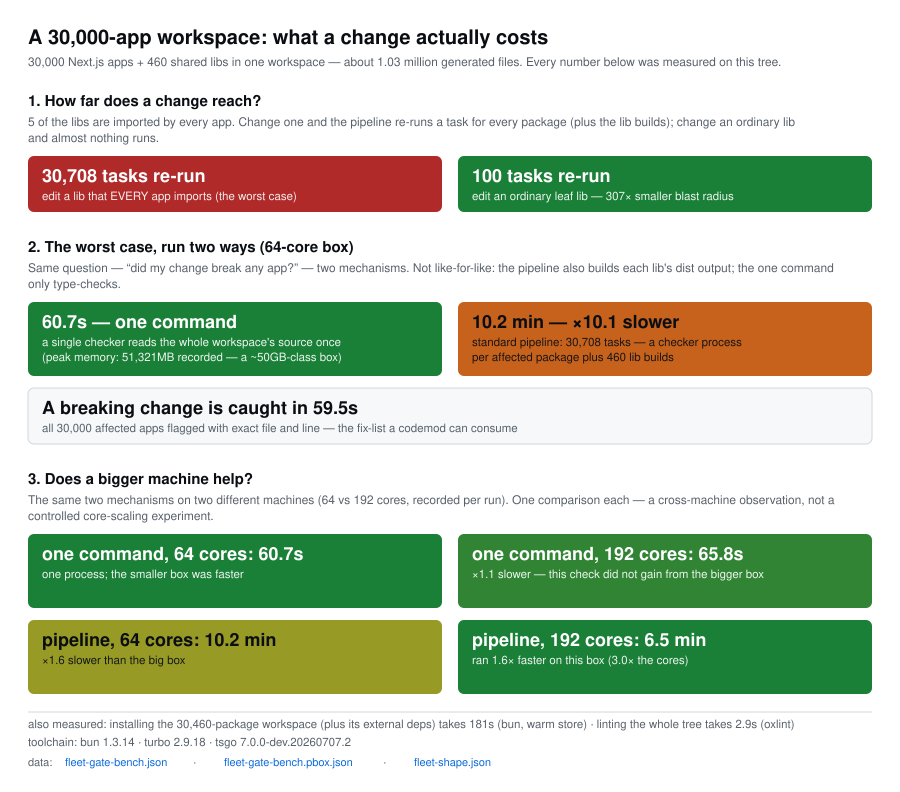

# The Fleet Preset: a Measured Production Shape

`--preset fleet` generates the workspace shape measured on a production fleet of ~30,000 small Next.js apps sharing 460 TypeScript libraries. The standard generated workspace is uniform by design (every app imports the same number of libs, every lib layer looks the same); the measured fleet is skewed on every axis that drives benchmark behavior. This preset reproduces that skew deterministically: the tree-agnostic operations (`make install/build/typecheck/graph/focus/prune`) and the gate bench run against a real-world shape at real-world scale and stay reproducible (the self-generating bench scripts still scaffold their own layered trees). Sources of record: `bench/fleet-shape.json` (shape targets vs the generated tree), `bench/fleet-gate-bench.json` / `bench/fleet-gate-bench.pbox.json` (the optimal-stack gate on this shape, measured on a 64-core and a 192-core box — the Results section below).

```bash
make gen-fleet                 # 30,000 apps / 460 libs, ~1.03M generated files
make gen-fleet APPS=3000       # same lib graph, scaled-down app count
make fleet-verify              # recompute the tree's graph metrics vs the targets
make fleet-gate-bench          # bun install + tsgo whole-program gate + turbo + oxlint
make typecheck-whole           # the one-command whole-workspace type gate (pre-push)
make fleet-chart               # re-render the results infographic from the bench JSONs
```

## The Shape

Four structural properties separate the fleet from the uniform `layered` workspace (`--shape skewed` implements them; `--preset fleet` sets the measured scale):

1. **A universal foundation tier that is universal for apps only.** Five libs are imported by ≥97% of apps, while libs average only 1.7 lib deps. (`--universal` under `layered` injects the tier into every lib; `skewed` never force-injects it — a lib imports a foundation lib only through its own dep picks, which is why the foundation carries the highest lib in-degree without being in every lib.)
2. **A popular tier with flat-then-cliff adoption.** 13 libs are imported by more than half the apps, with adoption declining ~93%→50% across the tier, then falling off a cliff into a long tail — a curve a zipf slope cannot produce. Modeled as a per-app bernoulli draw over 10 semi-universal libs (`--popular`).
3. **A bimodal lib graph.** ~40% of libs are dependency-less sinks, while a dense region forms deep, narrow chains — depth up to exactly 15, fat in the 8–15 range — that converge on a small trunk of high-in-degree libs. Modeled with an index-ramped sink rate, near-neighbor chain deps, zipf trunk picks, and a depth cap at the measured max.
4. **Variable app fanout, moderate app size.** Apps take a median of 14 workspace deps (p90 17) with a median dependency closure of 43 libs — tight, because most closures share the same popular core. Apps are ~30 TS files (`--app-modules 28`), not the two-file stubs of the standard workspace, so whole-repo typecheck and lint pay for ~1.03M files at full scale.

`scripts/fleet-shape-verify.mjs --expect fleet` recomputes every metric from the generated `package.json` files on disk and gates them against the measured targets; the committed `bench/fleet-shape.json` shows the current match (15/15 inside tolerance: package counts, fanout median, depth max, and the >25% adoption count land exact; the >50% adoption count is +2; most distribution metrics sit within 15% and the top lib in-degree runs +32% against its ±40% band).

| metric | measured fleet | generated |
| --- | --- | --- |
| apps / libs | 30,000 / 460 | 30,000 / 460 |
| workspace deps per app (median / p90) | 14 / 17 | 14 / 16 |
| app closure (p25 / median / p75) | 41 / 43 / 44 | 35 / 40 / 45 |
| libs imported by >50% / >25% / >10% of apps | 13 / 16 / 21 | 15 / 16 / 18 |
| lib deps per lib (mean) / sink libs | 1.71 / 40.4% | 1.72 / 42.8% |
| lib graph depth (median / max) | 2 / 15 | 1 / 15 |
| top lib in-degree (from libs) | 130 | 171 |

(Generated column from `bench/fleet-shape.json`; the committed file is the full-scale run.)

At full scale one app is emitted under a renamed package (`@demo/app-13215` →
`@demo/app-13215-r1`): bun rejects a workspace when two distinct member names collide
in its u32-truncated name hash (oven-sh/bun#36386), and the 30,000:460 name universe
contains exactly one such pair — universes below 13,215 apps contain none (the
pair needs `app-13215` to exist; the quickstart's `APPS=3000` emits no rename). The
generator pre-scans for these collisions and renames the colliding app — name only,
so directories, file paths, and every graph metric are unchanged
(`bunNameHashRenames` in the generator summary records it).

## What the Preset Deliberately Does Not Model

Divergences from the measured fleet, recorded in `bench/fleet-shape.json` `fleetContext`:

- **The fleet is not one workspace today.** It runs ~30,000 independent per-app installs with per-app lockfiles; libs are linked by relative-path `file:` deps. This preset models the single-workspace conversion of that fleet — the thing the rest of this repo benchmarks. A conversion also has two mechanical prerequisites the generator sidesteps by construction: the measured lib graph contains 3 small dependency cycles (largest ≤6 nodes) and 2 duplicate package names, both of which a workspace tool rejects; the generated graph is an acyclic tree of unique names.
- **Source-linked libs.** 421 of the 460 measured libs point `main`/`types` at `src/*.ts`, and apps transpile lib source directly — there is no per-lib build step in the fleet. The whole-program tsgo gate (which reads lib source via `tsconfig.whole.json` paths) mirrors the fleet's actual typecheck semantics; the turbo `^build` path prices the per-package orchestration the fleet does not have yet.
- **External dependency breadth.** The fleet's apps collectively depend on 1,430 distinct external packages (1,710 with devDeps); the generated workspace holds the external surface at the repo's standard pinned set so install benches measure workspace shape, not registry breadth or third-party postinstall behavior.
- **Version spread.** Two ranges of the framework dependency dominate the fleet at roughly 73%/25% (a rollout mid-flight), with long-tail spec divergence on most popular externals. The generated tree models the post-catalog end state; `--skew 25` approximates the two-version split (on react rather than next).
- **Per-package scripts.** Nearly every fleet app has a lint script (98.7%, ESLint 9 flat config) but only 11.7% of apps and 36.3% of libs have a test setup (vitest where present). The generated tree emits `typecheck` everywhere and `test` only under `--test-task`, which emits it for every package; scale test-axis results accordingly.

## Results: the Gate at Full Scale

`node scripts/optimal-gate-bench.mjs fleet` runs the same scenario as the 4000:400 gate
([OPTIMAL-STACK.md](OPTIMAL-STACK.md), the canonical layered record) — bun installs the workspace, a foundation lib revs, one tsgo program checks every app from source, a breaking signature must turn all 30,000 apps red, turbo prices the orchestrated per-package path, oxlint sweeps the tree — and writes `bench/fleet-gate-bench.json` (the canonical `bench/optimal-gate-bench.json` stays the 4000:400 record). `fleet:<apps>` scales the app count while keeping the lib graph at its measured size, for machines that cannot hold the full shape.

Measured at full scale on two machines — a 64-core dev box (`bench/fleet-gate-bench.json`)
and a 192-core c8g.48xlarge (`bench/fleet-gate-bench.pbox.json`), the same recorded
toolchain on both (versions in the JSONs):

| phase | 64-core | 192-core |
| --- | --- | --- |
| bun install (30,460 packages, warm store) | 180.6s | 194.5s |
| whole-workspace type check (one tsgo program, from source) | 60.7s / 51.3GB peak RSS | 65.8s / 52.7GB |
| breaking foundation rev → all 30,000 apps red (TS2554, exact file:line) | 59.5s | 69.5s |
| turbo per-package gate (30,708 tasks incl. the 460 tsc `^build`s) | 613.0s | 387.2s |
| leaf-lib gate (`--filter=...leaf`, 100 tasks) | 116.3s | 90.4s |
| oxlint across the tree | 2.9s | 3.6s |

Three facts fall out. For a universal rev the one-program check beats the per-package
pipeline **10.1×** on the clean pair (60.7s vs 613.0s; not like-for-like — the pipeline
also emits each lib's dist) — the pipeline's 30,248 typecheck processes each re-read the
same shared types, plus the 460 lib builds. The one-program check was not faster on the
bigger machine (60.7s → 65.8s on the 192-core box; one observation per machine, a
cross-machine comparison, not a controlled core-scaling experiment). The per-package
pipeline ran 1.6× faster on that box. The blast-radius contrast is structural: a
universal rev re-runs 30,708 tasks (a typecheck for each of the 30,248 packages in the
foundation's closure + the 460 lib builds), a leaf rev 100 — 307× fewer.



[High-resolution PNG](bench/charts/fleet-gate.png) · rendered by `scripts/fleet-chart.mjs`
(`make fleet-chart`) from the two gate records + `bench/fleet-shape.json`, byte-gated in CI.

## The Sliced Gate: Using the Whole Box

The one-program gate cannot use a big machine: its own reference run is 59.0s on 64
cores and 67.8s on 192, at 755% / 1,629% CPU — most of either box idle. (The fleet-gate
records above read 60.7s / 65.8s on their own trees — run-to-run spread; every ratio here
is computed within one record.) The per-package pipeline uses every core but re-parses
the shared libs ~30,000×. The middle point wins outright: partition the apps into K
slices, each a tsgo program over all lib source + 1/K of the apps, run concurrently
(`scripts/sliced-gate-bench.mjs` → `bench/sliced-gate-bench.json`; 192-core column
`bench/sliced-gate-bench.pbox.json`):

| K | 64-core wall | 192-core wall | max slice RSS† |
| --- | --- | --- | --- |
| 1 (reference) | 59.0s | 67.8s | 52.0GB |
| 2 | 28.8s | 32.7s | 25.5GB |
| 4 | 16.9s | 19.8s | 13.6GB |
| 8 | 11.6s | 12.1s | 7.1GB |
| 16 | **9.9s** | 8.6s | 3.9GB |
| 24 | — | 7.2s | 2.6GB |
| 32 | 10.4s | 6.8s | 2.2GB |
| 48 | — | **6.3s** | 1.6GB |

† RSS from the 64-core record; the K=24/48 rows come from the 192-core record because
the 64-core sweep runs K ∈ {2, 4, 8, 16, 32} (hence its "—" wall cells). At every shared
K the two boxes' RSS agree within 4%.

**6.0× faster than the one-program gate on the same 64-core box, and 10.7× on the
192-core box (6.3s at K=48) — the machine the one-program gate could not use is now the
fastest way to run it.** The verdict is identical: the breaking-rev union check asserts that the distinct error locations across
all slices equal the whole-program set exactly (30,171 = 30,171; lib-side errors dedupe,
app-side errors neither vanish nor invent). The breaking verdict lands in 10.1s on 64
cores and 6.6s on 192 — on each box under Flow's server-incremental row on this shape
(14.9s / 12.9s), and the sliced number is a from-scratch batch run, not a resident
server. Slices are exact-`files` programs (per-app globs would make config matching
quadratic and bias the sweep). Re-parsing the lib closure K times is cheaper than it
sounds: total CPU stays within +34% of the one-program run on the 64-core box (~446s →
518s at K=16, 598s at K=32) and lands *below* it at every K on the 192-core box (~1,104s
→ 849–1,033s), while per-slice memory falls to laptop-class (3.9GB at K=16 vs the 52GB
monolith).

## The Pre-Push Command

For anyone editing a foundation lib, the measured result above is packaged as a day-to-day
command:

```bash
make typecheck-whole    # scripts/whole-typecheck.mjs
```

One tsgo process reads every app and lib from source and prints a plain verdict: `GREEN`
(safe to push) or `RED` with a digest — error count, top error codes, how many apps/libs
are affected, first sample lines — and exits with the checker's code, so the same command
works as a CI gate. On this shape that is ~1 minute; the clean run records ~51GB peak RSS. A
breaking signature comes back as every affected call site with exact file and line, the
input a codemod consumes. It needs no build step, no cache, and no orchestration — just a
box with the RAM.

Two companion records run the same scenario under different tooling: a Flow-dialect
mirror of this shape (batch + resident-server rows — server-style incrementality tsgo does not have;
[TYPECHECKERS.md](TYPECHECKERS.md#flow-on-the-fleet-shape), `bench/fleet-flow-bench.json` +
`.pbox.json`) and yarn 4 with a native-PnP tsgo build
([TOOLING.md](TOOLING.md#yarn-pnp-toolchain-compatibility), `bench/yarn-fleet-bench.json`).
