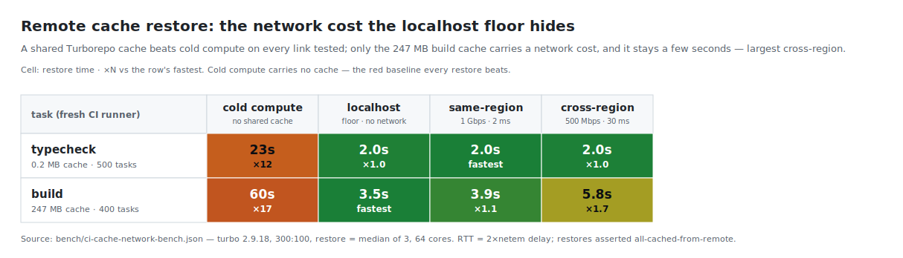

# Limits and Gotchas at 20k Apps

What focus/cache/`--affected` cannot save you from, and the gotchas this build hit.

## Irreducible Limits at 20k

Scoping and caching reduce *execution*; these costs remain because they are inherent to one workspace graph and one lockfile.

1. **The single lockfile.** One `pnpm-lock.yaml` describes the whole workspace: 9,897 → 153,967 lines across 300 → 4,300 packages (≈36 lines/package), extrapolating to multi-MB / ~720k lines at 20k. Every install reads it and (on any dep change) rewrites it; every dep-touching branch is a merge-conflict surface. You cannot `--filter` it. Mitigations trade away its value ([OPTIMIZATIONS.md §1.5](OPTIMIZATIONS.md#15-lockfile-churn-and-merge-conflicts)): `shared-workspace-lockfile=false` (loses cross-package dedup) or git-branch lockfiles (avoids conflicts, not size).

2. **The Turbo graph-load floor.** `--filter`, `--affected`, and `prune` all parse every `package.json` and build the full DAG *before* selecting a subset — O(repo) on every invocation, including no-ops. A fully-cached `turbo run typecheck` grew 1.5s → 20.5s (200 → 4,000 apps); extrapolated, the per-command floor at 20k is ~100s before any task runs. The only escape in turbo is to stop having one graph (shard), giving up atomic cross-package changes. Vite Task (Vite+'s fs-traced runner) has no such floor: its focused warm run stays flat across 3× growth (0.85s → 0.86s, 400 → 1,200 tasks, vs turbo's 1.2s → 3.0s) at the price of 2–3.7× slower whole-repo typecheck (`bench/vite-task-bench.json`, [TOOLING.md](TOOLING.md#vite-vp-task-runner-and-tool-layer)).

3. **Foundation/root-change blast radius = the whole repo.** A change to a widely-used lib or a root input (`tsconfig.base.json`, the catalog React/Next version, the pnpm/turbo/next version — all in every task's hash) invalidates the cache for all dependents.
   - Editing low-layer `lib-003` rebuilds 1,080 of 1,200 packages; at 20k that is ~18k.
   - Same shape for `test` (`bench/test-axis-bench.json`, 1,000:200): a universal-foundation edit re-tests 1,200 of 1,200 vs a leaf's 21 (~57× spread). Cold wall-clocks (14.3s vs 3.0s) are over minimal smoke bodies, so they bound Turbo orchestration + `node --test` startup, not real suite runtime; the count is the evidence.
   - Remote cache only helps the *second* consumer; after a foundation edit it restores nothing (see [Remote Cache](#remote-cache-amortizing-the-orepo-cold-start)).
   - The lever for the unavoidable whole-repo case is sharding independent test tasks across machines (1,200 → 150/shard at eight shards).

   The fix is organizational: change foundations rarely.

4. **Materializing the whole tree (inodes/disk).** Installing all 20k apps creates a `node_modules` per package: isolated-linker symlinks measured 4,211 at 300/100 → hundreds of thousands at 20k, plus the `.pnpm` store. 40 Next apps = 156 MB of `.next` → 20k ≈ 78 GB; inodes can exhaust a modest filesystem. Levers: `node-linker=pnp`, don't build everything.

5. **Editor / language server.** Opening *one app* is O(closure): the server loads the opened app's closure (65 libs / 1,123 files), flat as the repo grows 8× (see [Editor and Language Server](#editor-and-language-server)). Opening the *whole* workspace as one project at 20k is genuinely O(repo): a multi-GB program with slow cross-package IntelliSense. Mitigations (sub-tree, sparse-checkout, pnp + editor SDK) scope it back to a closure.

6. **git at 20k.** ~130k+ source files; `git status`/`checkout`/`clone` are O(worktree) and need `fsmonitor` + `sparse-checkout` + partial clone (Scalar-style setup).

7. **Deploy-platform per-project model.** One Vercel project per app, but Vercel caps projects per repo (Pro: 60; [Vercel limits](https://vercel.com/docs/limits)), so 20k apps split across repos/teams — itself a sharding pressure. Vercel's native "skip unaffected projects" does not consume a concurrent build slot; the deprecated `turbo-ignore` Ignored Build Step does. Use `turbo run --affected` plus the native skip.

pnpm + Turborepo's single-graph, single-lockfile model has a ceiling where graph-load, lockfile, and foundation-blast dominate. The workaround is to stop having one graph: shard into independent workspaces, or move to a daemon + remote-execution build system (Bazel/Buck2 + build farm).

## Remote Cache: Amortizing the O(repo) Cold Start

Every CI runner starts with an empty local cache. A Turborepo remote cache (`turborepo-remote-cache@2.11.2`, localhost) lets later runners *restore* an artifact instead of recomputing it. Head-to-head per task/scale (`bench/ci-cache-bench.json`, 64-core box): typecheck restores 12.5× faster than no-cache cold at 300:100 (1.9s vs 23.6s), 11.4× at 1,000:200 (5.9s vs 67.2s); build 15.5× at 300:100 (4.0s vs 62.7s). Restore is itself O(repo) — it skips execution but pays Turbo's graph-load + hashing — so it grows with the repo (1.9s → 5.9s) and holds ~11–12× rather than widening.

**Someone still pays the first build.** A remote cache only helps consumers after the first; the first runner computes and uploads (the "seed"). On localhost the seed is within compute noise; over a network the real seed cost is the artifact transfer.

**Across a fleet it amortizes.** With R runners building the identical closure, the first seeds and R−1 restore, so per-runner cost converges toward the restore time (5.9s at 1,000:200). A real fleet builds different commits, so reuse is partial and the factor lower (`bench/ci-cache-bench.json`).

**The network cost, measured.** Shaping the loopback with `tc netem` prices what the floor leaves as arithmetic (`bench/ci-cache-network-bench.json`, 300:100, 64-core box; RTT = 2× the netem delay):

| task (cache size) | no-cache cold | localhost floor | same-region (1 Gbps, 2 ms) | cross-region (500 Mbps, 30 ms) |
| ----------------- | ------------- | --------------- | -------------------------- | ------------------------------ |
| typecheck (0.2 MB) | 23.2s | 2.0s | 2.0s | 2.0s |
| build (247 MB) | 60.3s | 3.5s | 3.9s | 5.8s |

Cost scales with cache **size**, not repo size. The 0.2 MB typecheck cache restores in the same time on every link. The 247 MB build cache grows with the link (+0.4s same-region, +2.3s cross-region) but every restore stays ≥×10 under the 60s cold compute (×17 localhost down to ×10 cross-region), so the shared cache wins on any link.

[High-resolution PNG](bench/charts/cache-network.png)

**It cannot help when an edit changes everything.** A remote cache restores only artifacts an edit did not invalidate (`bench/ci-cache-bench.json`, 300:100 under `--universal 1`, 500 tasks):

- **leaf edit** → **486 of 500** restored, 14 recomputed.
- **foundation edit** → **0 of 500** restored, all recomputed.

This is §3's blast radius from the cache's side: scope an edit and the cache absorbs the rest; touch a foundation and someone pays the full cold rebuild.

## Editor and Language Server

Before answering a keystroke, the language server loads a project. Racing `tsserver` (VS Code's) vs `tsgo --lsp` (TypeScript's native-preview LSP), opening one app's `page.tsx`; cross-package nav resolves to source build-free (tsconfig `paths` → `packages/*/src`), pulling the app's real closure (65 libs / 1,123 files at 4,000:300) into the server (`bench/editor-loop-bench.json`; tsgo `7.0.0-dev.20260614.1`, TypeScript 5.9.3; 64-core box):

| metric                        | tsserver | tsgo LSP | ratio |
| ----------------------------- | -------- | -------- | ----- |
| cold open (spawn → first def) | 1,620ms  | 86ms     | 18.8× |
| peak RSS                      | 380MB    | 275MB    | 1.4×  |
| warm go-to-def                | 1ms      | 0ms      | —     |
| warm hover                    | 1ms      | 2ms      | —     |

(4,000 apps / 300 libs.) tsgo loads the same closure ~19× faster and with ~30% less memory; once warm both answer in ≤2ms. Both resolve the cross-package definition to the exact lib source with zero fatal diagnostics. (Completion is recorded by item count, not scored: tsgo 6,247 items vs tsserver 1,009 at the same position.)

**It is O(closure), not O(repo)**, shown from both sides:

- **Apps grow, closure fixed** (300 libs; 500 → 4,000 apps): closure stays 65 libs / 1,123 files; cost flat (tsserver 1,619 → 1,620ms, tsgo 84 → 86ms). 8× the repo, ~1.0× the cost.
- **Closure grows** (2,000 apps; 100 → 300 libs): closure grows 628 → 1,123 files; cost rises (tsserver 1,393 → 1,614ms, 355 → 380MB; tsgo 80 → 84ms, 238 → 272MB).

The lever is the same: scope the open to one app's closure; a faster server (tsgo) cuts the one cost that scales by ~19×. Opening the *whole* workspace at 20k still means a repo-sized program; where that's unavoidable, the daemons are measured to 1,000,000 modules in [TYPECHECKERS.md](TYPECHECKERS.md#the-daemons-and-codegen) (`bench/lsp-scale-bench.json`): tsgo `--lsp` opens 1M in 17.5s and serves a 2.2s squiggle at 66.1GB.

## Open Questions

Measured: gen; install (cold/warm/truly-cold; pnpm-isolated/hoisted/bun/yarn-nm/yarn-PnP; five-way frozen CI-runner install incl. npm, `container-install-bench.json`); typecheck, focus build, prune, deploy, publish, diamond, dev-sim; Next-vs-Vite build, tsc-vs-tsgo, spec-form/node-linker; remote-cache restore-vs-rebuild (incl. network cost, `ci-cache-network-bench.json`); editor project-load + RSS; task orchestration (`vite-task-bench.json`).

Gaps:

1. Direct lockfile measurement at 10k/20k. Size is measured through 4,000 apps (`results.json`); resolve-vs-verify (`lockfile-bench`) to 2,000; the 20k figure is extrapolated.
2. Turbo graph-load in isolation (`turbo run build --dry`), distinct from §2's fully-cached floor.
3. Foundation-change rebuild *time*: `test`-task selection is by COUNT (foundation 1,200 vs leaf 21 at 1,000:200); the *build* wall-clock (count 1,080) and real suite runtime stay open.
4. `pnpm install --filter app...` at scale: install time + footprint vs `turbo prune` at 10k/20k (materialization scoping confirmed, `focus-install-bench`).
5. pnpm's own `node-linker=pnp`. Yarn PnP install/footprint + toolchain compat measured ([TOOLING.md](TOOLING.md#yarn-pnp-toolchain-compatibility), `pnp-compat-bench.json`); editors under PnP and pnpm's pnp linker stay open.
6. Cold onboarding: fresh `git clone` + `pnpm install` at 10k/20k.
7. Peak memory under `--concurrency=100%` typecheck/build (OOM risk).

## Gotchas This Build Hit

- Turbo input hashing **and** `turbo prune` respect `.gitignore`; generated, gitignored source is invisible to both (`--use-gitignore=false` for prune; move `.gitignore` aside for dev-sim).
- `catalog:` entries in `pnpm-workspace.yaml` are read only by pnpm: Vercel, npm, bun, and yarn do not. bun's catalog support lives in `package.json` (`bench/wave-rollout-bench.json`); yarn 4's in `.yarnrc.yml` (`bench/yarn-rollout-bench.json`; it reads neither foreign home).
- `turbo prune` does not copy root configs referenced via `../../` (e.g. `tsconfig.base.json`).
- `pnpm install --filter app...` scopes what it materializes (1 of 80 apps, `focus-install-bench`) but still resolves the one shared lockfile; for a self-contained per-app lockfile use `pnpm deploy` / `turbo prune`.
- `workspace:*` deploys the in-tree source at its local version (rewrite happens only on `pnpm publish`).
- bun ignores `pnpm-workspace.yaml` (needs `package.json` "workspaces"); bun 1.3 workspaces default to its isolated linker; hoisted is its single-package default (`bench/bun-safety-bench.json` rung D).
- Don't carry `eslint: { ignoreDuringBuilds: true }` from webpack-era configs: the generated Next 16 config omits the `eslint` key; run lint as a separate Turbo task.
- `spawnSync` buffers child output in memory → ENOBUFS at scale; pipe to a file.
- Even a fully-cached `turbo run` is O(repo); see the graph-load floor (item 2).
