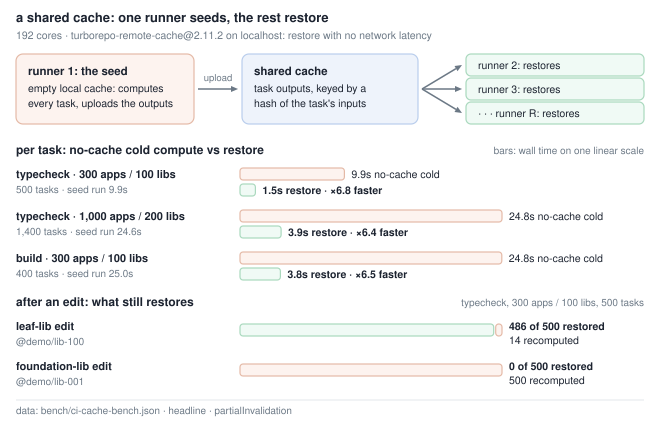
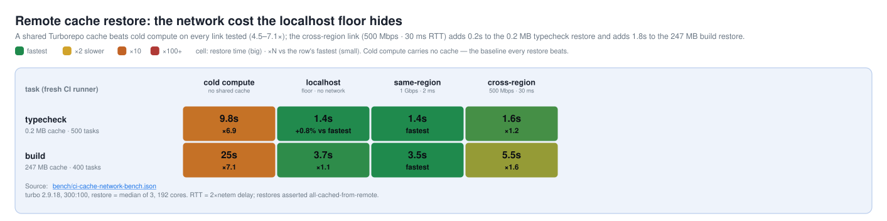

# Limits and Gotchas at 20k Apps

What focus/cache/`--affected` cannot save you from, and the gotchas this build hit. Numbers are measured on [the workspace under test](README.md#the-workspace-under-test) at the stated scales unless a distinct corpus is named.

## Irreducible Limits at 20k

Scoping and caching reduce *execution*; these costs remain because they are inherent to one workspace graph and one lockfile.

1. **The single lockfile.** One `pnpm-lock.yaml` describes the whole workspace: 10,185 → 746,255 lines across 300 → 20,300 packages (34–37 lines/package; 21,019,478 bytes at 20,000 apps, `results.json`). Every install reads it and (on any dep change) rewrites it; every dep-touching branch is a merge-conflict surface. You cannot `--filter` it. Mitigations trade away its value ([OPTIMIZATIONS.md §1.5](OPTIMIZATIONS.md#15-lockfile-churn-and-merge-conflicts)): `shared-workspace-lockfile=false` (loses cross-package dedup) or git-branch lockfiles (avoids conflicts, not size; under pnpm 12 enabled via `pnpm-workspace.yaml` `gitBranchLockfile: true` — the npm-style `.npmrc` key is ignored, `bench/lockfile-merge-bench.json`).

2. **The Turbo graph-load floor.** `--filter`, `--affected`, and `prune` all parse every `package.json` and build the full DAG *before* selecting a subset — O(repo) on every invocation, including no-ops. A fully-cached `turbo run typecheck` grew 1.0s → 23.9s (200 → 10,000 apps, `results.json`, 192-core box). The scoped commands show the same term at fixed output: at 2,000 / 5,000 / 20,000 apps `turbo prune` emits the same-sized 101-package subtree in 1.9s / 4.4s / 25.0s, and a focused build of a 100-package closure takes 11.9s / 15.4s / 39.5s — at 20,000 apps a scoped command costs 23–28s more than the same-sized selection does at 2,000 (prune +23.1s, focused build +27.6s). The only escape in turbo is to stop having one graph (shard), giving up atomic cross-package changes. Vite Task (Vite+'s fs-traced runner) keeps its focused warm run flat as the workspace grows 3× (400 → 1,200 tasks; the focused selection is 61 and 56 tasks): 0.81s → 0.83s, where turbo's grows 0.76s → 1.01s — turbo is the faster of the two in the 400-task workspace, vp by 1.2× in the 1,200-task one. The trade is a whole-repo typecheck 8.4–10.7× slower cold and 3.2–4.1× slower warm (`bench/vite-task-bench.json`, [TOOLING.md](TOOLING.md#vite-vp-task-runner-and-tool-layer)).

3. **Foundation/root-change blast radius = the whole repo.** A change to a widely-used lib or a root input (`tsconfig.base.json`, the catalog React/Next version, the pnpm/turbo/next version — all in every task's hash) invalidates the cache for all dependents.
   - Editing low-layer `lib-003` rebuilds 1,080 of 1,200 packages; at 20k that is ~18k.
   - Same shape for `test` (`bench/test-axis-bench.json`, 1,000:200): a universal-foundation edit re-tests 1,200 of 1,200 vs a leaf's 21 (~57× spread). Cold wall-clocks (12.0s vs 2.7s) are over minimal smoke bodies, so they bound Turbo orchestration + `node --test` startup, not real suite runtime; the count is the evidence.
   - Remote cache only helps the *second* consumer; after a foundation edit it restores nothing (see [Remote Cache](#remote-cache-amortizing-the-orepo-cold-start)).
   - The lever for the unavoidable whole-repo case is sharding independent test tasks across machines (1,200 → 150/shard at eight shards).

   The fix is organizational: change foundations rarely.

4. **Materializing the whole tree (inodes/disk).** Installing all 20k apps creates a `node_modules` per package: isolated-linker symlinks measured 3,011 at 200 apps / 100 libs → 241,712 (of 374,827 `node_modules` entries) at 20,000 apps / 300 libs (`results.json`), plus the `.pnpm` store. 40 Next apps = 156 MB of `.next` → 20k ≈ 78 GB; inodes can exhaust a modest filesystem. The levers are `node-linker=pnp` and not building everything.

5. **Editor / language server.** Opening *one app* is O(closure): the server loads the opened app's closure (65 libs / 1,123 files), flat as the repo grows 8× (see [Editor and Language Server](#editor-and-language-server)). Opening the *whole* workspace as one project at 20k is genuinely O(repo): a multi-GB program with slow cross-package IntelliSense. Mitigations (sub-tree, sparse-checkout, pnp + editor SDK) scope it back to a closure.

6. **git at 20k.** ~130k+ source files; `git status`/`checkout`/`clone` are O(worktree) and need `fsmonitor` + `sparse-checkout` + partial clone (Scalar-style setup).

7. **Deploy-platform per-project model.** One Vercel project per app, but Vercel caps projects per repo (Pro: 60; [Vercel limits](https://vercel.com/docs/limits)), so 20k apps split across repos/teams — itself a sharding pressure. Vercel's native "skip unaffected projects" does not consume a concurrent build slot; the deprecated `turbo-ignore` Ignored Build Step does. Use `turbo run --affected` plus the native skip.

pnpm + Turborepo's single-graph, single-lockfile model has a ceiling where graph-load, lockfile, and foundation-blast dominate. The workaround is to stop having one graph: shard into independent workspaces, or move to a daemon + remote-execution build system (Bazel/Buck2 + build farm).

## Remote Cache: Amortizing the O(repo) Cold Start

Every CI runner starts with an empty local cache. Turborepo caches each task's outputs — the built files for a `build`, the checker's exit status and logs for a `typecheck` — keyed by a hash of that task's inputs (its own source, its dependencies' cached outputs, and global inputs like `tsconfig.base.json` and the pinned tool versions). A Turborepo remote cache (`turborepo-remote-cache@2.11.2`, localhost) shares those outputs across machines, so a later runner whose task inputs hash the same *restores* the stored output instead of recomputing it (Figure 1). Head-to-head per task/scale (`bench/ci-cache-bench.json`, 192-core c8g.48xlarge): typecheck restores 6.8× faster than no-cache cold at 300:100 (1.5s vs 9.9s), 6.4× at 1,000:200 (3.9s vs 24.8s); build 6.5× at 300:100 (3.8s vs 24.8s). Restore is itself O(repo) — it skips execution but pays Turbo's graph-load + hashing — so it grows with the repo (1.5s → 3.9s) and holds ~6.4–6.8× rather than widening. The ratio is specific to the box: the cold side is core-bound compute (`env.coreBound` in the record), the restore is not.

[High-resolution PNG](bench/charts/fig-remote-cache.png)

**Figure 1.** A task's outputs are stored under a hash of its inputs, so the first runner to compute a task pays for it and uploads the result, every later runner with the same inputs downloads it instead, and an edit changes only the hashes of the tasks downstream of it — a leaf edit leaves most tasks restorable, a foundation edit none.

Figure 1 fields

`bench/ci-cache-bench.json`: per `headline` row `task`, `scale`, `apps`, `libs`, `totalTasks`, `coldNoRemoteMs`, `coldSeedMs`, `restoreMs`, `speedupVsCold`; `partialInvalidation` — `task`, `scale`, `apps`, `libs`, `totalTasks`, and per `leaf`/`foundation` `lib`, `restored`, `recomputed`, `total`; `env.cores`, `versions.remoteCacheServer`, `remoteCache.transport`, `samples.{cold,buildCold,restore}`, `concurrency`.

**Someone still pays the first build.** A remote cache only helps consumers after the first; the first runner computes and uploads (the "seed"). On localhost the seed is within compute noise; over a network the real seed cost is the artifact transfer.

**Across a fleet it amortizes.** With R runners building the identical closure, the first seeds and R−1 restore, so per-runner cost converges toward the restore time (3.9s at 1,000:200; 10 runners amortize 4.2×, 50 runners 5.8×). A real fleet builds different commits, so reuse is partial and the factor lower (`bench/ci-cache-bench.json`).

**The network cost, measured.** Shaping the loopback with `tc netem` prices what the floor leaves as arithmetic (`bench/ci-cache-network-bench.json`, 300:100, 192-core c8g.48xlarge; RTT = 2× the netem delay):

| task (cache size) | no-cache cold | localhost floor | same-region (1 Gbps, 2 ms) | cross-region (500 Mbps, 30 ms) |
| ----------------- | ------------- | --------------- | -------------------------- | ------------------------------ |
| typecheck (0.2 MB) | 9.8s | 1.4s | 1.4s | 1.6s |
| build (247 MB) | 24.7s | 3.7s | 3.5s | 5.5s |

The network cost grows with cache **size**. Same-region, both restores sit inside the spread of their own localhost samples (typecheck 1.40–1.56s, build 2.4–4.1s). The cross-region profile (500 Mbps and 30 ms RTT, varied together) adds 0.2s to the 0.2 MB typecheck restore and 1.8s to the 247 MB build restore. Every restore stays ×4.5–×7.1 under the cold compute it replaces (typecheck ×6.9 localhost to ×6.0 cross-region; build ×6.7 to ×4.5), so the shared cache wins on every link measured.

[High-resolution PNG](bench/charts/cache-network.png)

**It cannot help when an edit changes everything.** A remote cache restores only artifacts an edit did not invalidate (Figure 1; `bench/ci-cache-bench.json`, 300:100 under `--universal 1`, 500 tasks): a leaf edit leaves **486 of 500** restored and 14 recomputed, a foundation edit **0 of 500** restored and all recomputed. This is §3's blast radius from the cache's side: scope an edit and the cache absorbs the rest; touch a foundation and someone pays the full cold rebuild.

## Editor and Language Server

Before answering a keystroke, the language server loads a project. Racing `tsserver` (VS Code's) vs `tsgo --lsp` (the native compiler's LSP; since GA it ships as `typescript@7`'s native `tsc --lsp`), opening one app's `page.tsx`; cross-package nav resolves to source build-free (tsconfig `paths` → `packages/*/src`), pulling the app's real closure (65 libs / 1,123 files at 4,000:300) into the server (`bench/editor-loop-bench.json`; tsgo 7.0.2, typescript 6.0.3's tsserver; 192-core c8g.48xlarge):

| metric                        | tsserver | tsgo LSP | ratio |
| ----------------------------- | -------- | -------- | ----- |
| cold open (spawn → first def) | 1,563ms  | 113ms    | 13.8× |
| peak RSS                      | 414MB    | 309MB    | 1.3×  |
| warm go-to-def                | 1ms      | 0ms      | —     |
| warm hover                    | 1ms      | 1ms      | —     |

(4,000 apps / 300 libs.) tsgo loads the same closure ~14× faster and with ~25% less memory; once warm both answer in ≤2ms. Both resolve the cross-package definition to the exact lib source with zero fatal diagnostics. (Completion is recorded by item count, not scored: tsgo 6,258 items vs tsserver 1,066 at the same position.)

**It is O(closure), not O(repo)**, shown from both sides:

- **Apps grow, closure fixed** (300 libs; 500 → 4,000 apps): closure stays 65 libs / 1,123 files; cost near-flat (tsserver 1,325 → 1,563ms, tsgo 113 → 113ms). 8× the repo, ≤1.2× the cost.
- **Closure grows** (2,000 apps; 100 → 300 libs): closure grows 628 → 1,123 files; memory rises (tsserver 389 → 413MB; tsgo 272 → 282MB) and cold open rises modestly (tsserver 1,324 → 1,328ms, tsgo 98 → 104ms).

The lever is the same: scope the open to one app's closure; a faster server (tsgo) cuts the one cost that scales by ~14×. Opening the *whole* workspace at 20k still means a repo-sized program; where that's unavoidable, the daemons are measured to 1,000,000 modules on a standalone generated layered program (not this workspace) in [TYPECHECKERS.md](TYPECHECKERS.md#the-daemons-and-codegen) (`bench/lsp-scale-bench.json`): tsgo `--lsp` opens 1M in 17.5s and serves a 2.2s squiggle at 66.1GB.

## Open Questions

The build already measures:

- gen; install (cold/warm/truly-cold; pnpm-isolated/hoisted/bun/yarn-nm/yarn-PnP; five-way frozen CI-runner install incl. npm, `container-install-bench.json`);
- typecheck, focus build, prune, deploy, publish, diamond, dev-sim;
- Next-vs-Vite build, tsc-vs-tsgo, spec-form/node-linker;
- remote-cache restore-vs-rebuild (incl. network cost, `ci-cache-network-bench.json`);
- editor project-load + RSS; task orchestration (`vite-task-bench.json`).

These gaps remain:

1. Lockfile resolve-vs-verify beyond 2,000 apps (`lockfile-bench`). Size is measured through 20,000 apps (`results.json`).
2. Turbo graph-load in isolation (`turbo run build --dry`), distinct from §2's fully-cached floor and its fixed-output prune/focus times. A whole-workspace tsc typecheck at 20,000 apps (the sweep stops it at 10,000).
3. Foundation-change rebuild *time*: `test`-task selection is by COUNT (foundation 1,200 vs leaf 21 at 1,000:200); the *build* wall-clock (count 1,080) and real suite runtime stay open.
4. `pnpm install --filter app...` at scale: install time + footprint vs `turbo prune` at 10k/20k (materialization scoping confirmed, `focus-install-bench`).
5. pnpm's own `node-linker=pnp`. Yarn PnP install/footprint + toolchain compat measured ([TOOLING.md](TOOLING.md#yarn-pnp-toolchain-compatibility), `pnp-compat-bench.json`); editors under PnP and pnpm's pnp linker stay open.
6. Cold onboarding: fresh `git clone` + a cold-store `pnpm install` at 10k/20k. The warm-store, no-lockfile install is measured (31.3s at 10,000 apps, 74.9s at 20,000, pnpm 12.8.1, `results.json`).
7. Peak memory under `--concurrency=100%` typecheck/build (OOM risk).

## Gotchas This Build Hit

- Turbo input hashing **and** `turbo prune` respect `.gitignore`; generated, gitignored source is invisible to both (`--use-gitignore=false` for prune; move `.gitignore` aside for dev-sim).
- `catalog:` entries in `pnpm-workspace.yaml` are read only by pnpm: Vercel, npm, bun, and yarn do not. bun's catalog support lives in `package.json` (`bench/wave-rollout-bench.json`); yarn 4's in `.yarnrc.yml` (`bench/yarn-rollout-bench.json`; it reads neither foreign home).
- `turbo prune` does not copy root configs referenced via `../../` (e.g. `tsconfig.base.json`).
- `pnpm install --filter app...` scopes what it materializes (1 of 80 apps, `focus-install-bench`) but still resolves the one shared lockfile; for a self-contained per-app lockfile use `pnpm deploy` / `turbo prune`.
- `workspace:*` deploys the in-tree source at its local version (rewrite happens only on `pnpm publish`).
- bun ignores `pnpm-workspace.yaml` (needs `package.json` "workspaces"); bun 1.3 workspaces default to its isolated linker; hoisted is its single-package default (`bench/bun-safety-bench.json` rung D).
- Don't carry `eslint: { ignoreDuringBuilds: true }` from webpack-era configs: the generated Next 16 config omits the `eslint` key; run lint as a separate Turbo task.
- `spawnSync` buffers child output in memory → ENOBUFS at scale; pipe to a file.
- Even a fully-cached `turbo run` is O(repo); see the graph-load floor (item 2).
