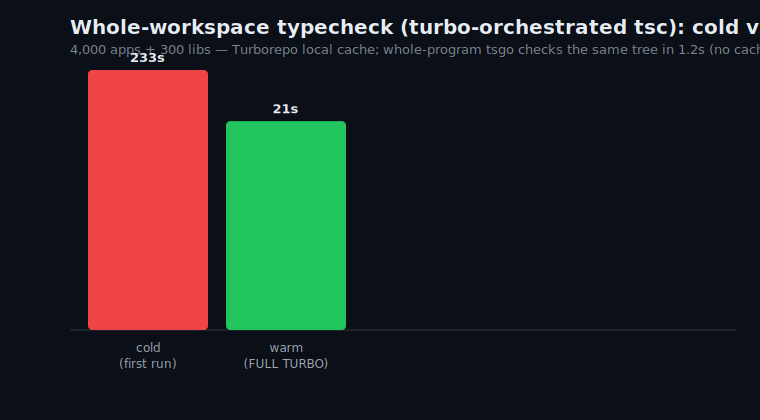
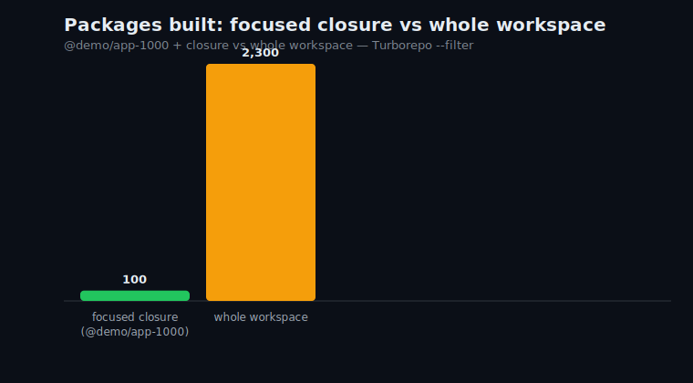
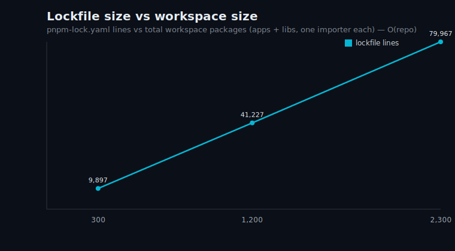
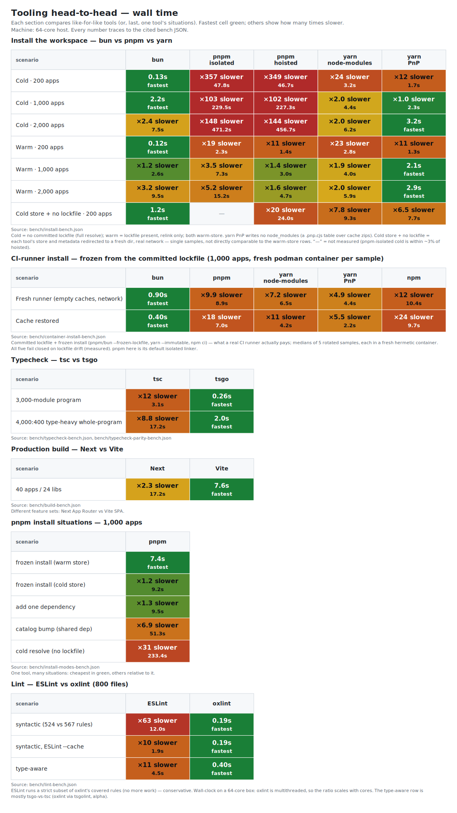

# Next.js Monorepo Scale Lab

Benchmark rig for a pnpm + Turborepo workspace of N Next.js apps and M shared libraries, with a layered dependency graph, measured to 4,000 apps / 300 libs (test-execution axis to 1,000 apps / 200 libs).

Result: whole-workspace operations (install, typecheck, warm `turbo run`, `turbo prune`'s graph load) scale with package count. A focused build (`turbo run --filter=<app>...`) executes one app's dependency closure and grows with that closure (×1.8 here), not app count. Avoid unscoped whole-repo execution. Numbers in [Results](#results-scaling-behavior).

Three layers of focus: install-time (`pnpm deploy` / `turbo prune @demo/app-2000 --docker`), task-time (`turbo run build --filter=@demo/app-2000...`), artifact-time (`turbo prune ... --docker` → `out/`). Measured by `scripts/measure.mjs` → [`bench/results.json`](bench/results.json).

Apps are tiny (count is the variable under test); libraries re-export ~16 modules in a layered DAG. pnpm catalogs pin one Next/React/TS version set; `workspace:*` links internal deps locally (`--versioned` → `workspace:^x.y.z`, see [WORKSPACE-VS-SEMVER.md](WORKSPACE-VS-SEMVER.md)); libs build to `dist/` (`dependsOn: ["^build"]`).

Quick start: `pnpm install && pnpm gen -- --apps 200 --libs 100 --modules 16 --clean && pnpm install`, then `turbo run build --filter=@demo/app-00100...` / `turbo run typecheck` / `turbo prune @demo/app-00100 --docker`. `generate.mjs` flags: `--apps` (50), `--libs` (50), `--modules` (16), `--app-deps` (4), `--lib-deps` (3), `--layers` (6). Start at 200–2,000 apps.

## Results: Scaling Behavior

Environment: `bench/env.json` (Neoverse-V1, 64 cores, 135 GB, arm64; Node 22, pnpm 10.29, Turbo 2.9, tsc 5.9.3). Four scale points, 200 → 4,000 apps (20× apps, ~14× packages); larger scales extrapolate. Via `scripts/measure.mjs` → `bench/results.json`.

| apps (libs) | typecheck cold | typecheck warm | focus build¹ | prune | build tasks | focus closure |
|---|---|---|---|---|---|---|
| 200 (100) | 19.0s | 1.5s | 11.5s | 0.9s | 300 | 75 |
| 1,000 (200) | 68.9s | 5.0s | 14.2s | 2.7s | 1,200 | 124 |
| 2,000 (300) | 127.2s | 7.6s | 15.5s | 5.3s | 2,300 | 100 |
| 4,000 (300) | 233.4s | 20.5s | 21.1s | 7.6s | 4,300 | 121 |

¹ `turbo run build --filter=<one app>...` (app + library closure); generated source made visible to Turbo for the run so warm/graph-load numbers reflect real per-package hashing. Install measured separately in [TOOLING.md](TOOLING.md#install-bun-vs-pnpm-vs-yarn-4).

Scaling factor, 200 → 4,000 apps:

| operation | factor | class |
|---|---|---|
| typecheck cold | ×12.3 | O(repo); ~linear in package count (×14) |
| typecheck warm | ×13.3 | O(repo); Turbo hashes every package on a full hit |
| prune | ×8.3 | O(repo); reads the whole graph |
| focus build | ×1.8 | O(closure); closure grew 75→121 while apps grew 20× |

The focus build tracks one app's closure (75–124 packages), not app count. Extrapolating to 20,000 apps: unscoped cold typecheck in tens of minutes, focused build in tens of seconds. What stays irreducibly O(repo) is in [LIMITS.md](LIMITS.md). Avoiding O(repo): scope with `--filter=<app>...` / `--affected`; an unscoped `turbo run` enumerates the whole graph even on cache hits; past ~20,000 apps loading one graph is itself O(repo), so shard.

### Charts

## Day-to-Day Developer Simulation

`scripts/dev-sim.mjs`, D developers each owning two apps + one lib in a 1,000-app / 200-lib workspace (1,200 packages), `--devs 4 --apps 1000 --libs 200`:

| operation | cost |
|---|---|
| onboarding: build a feature area (apps + lib closure) | median 10.8s |
| typecheck-on-save: edit an app, typecheck it | median 4.3s |
| build-before-push: edit an app, build it + closure | median 5.8s |
| lib-edit: rebuild your lib + dependents (21 packages) | median 11.6s |
| independence: a teammate's unrelated edit | adds 0 rebuilds |
| edit foundation lib (`lib-003`, low layer) | 1,080 of 1,200 packages rebuild |
| edit high-layer lib (`lib-197`) | 21 packages rebuild |

The inner loop is O(closure); a teammate's unrelated app adds zero rebuilds; a low-layer foundation lib rebuilds ~90% — why foundation edits lean on the remote cache and CI `--affected`. Optimization playbook in [`OPTIMIZATIONS.md`](OPTIMIZATIONS.md).

## Artifacts

- One app [deployed to Vercel](https://nextjs-monorepo-scale-demo.vercel.app) (pruned subtree, cloud build; 22s wall; `bench/deploy.json`).
- Four packages published to AWS CodeArtifact for the diamond demo (`scripts/diamond-demo.sh`).

## Findings by Area

Each companion doc measures one cost, with the bench JSON behind it.

**When a shared workspace is worth it.** It fits apps that share code and versions: the daily loop is O(closure) and the heavy O(repo) costs land on rare events, amortized by the committed lockfile and remote cache. Wrong fit for independent apps. Decision table in [FEASIBILITY.md](FEASIBILITY.md).

### Tooling Head-to-Head

Fastest install depends on what is cached and on workspace size; tsgo runs ~8.8–12× faster than tsc. Regenerate with `node scripts/comparison-chart.mjs`.

> High-resolution PNG of the chart above: [`bench/charts/tool-comparison.png`](bench/charts/tool-comparison.png).

The same grammar applied to one program growing to a million modules (full analysis in [TYPECHECKERS.md](TYPECHECKERS.md)):

> High-resolution PNG of the chart above: [`bench/charts/checker-scale.png`](bench/charts/checker-scale.png). Regenerate with `make scale-chart`.

- **Install cost.** pnpm cold install resolve-bound, ~linear: 47.8s → 471.2s (200 → 2,000 apps); bun 62–357× faster; yarn 4 scales flatter, overtaking bun at 2,000 apps. Cold resolve is rare with a committed lockfile: frozen install 7–9s at 1,000 apps; a missing lockfile pays ~16 min at 4,000 apps. ([FEASIBILITY.md](FEASIBILITY.md), [TOOLING.md](TOOLING.md))
- **CI-runner install (frozen, containers).** Five-way at 1,000 apps: **bun 0.9s** fresh / **0.4s** cache-restored, yarn-PnP 4.4s/2.2s, yarn-nm 6.5s/4.2s, pnpm 8.9s/7.0s, npm 10.4s/9.7s. All fail closed on lockfile drift. ([TOOLING.md](TOOLING.md))
- **yarn as rollout driver + PnP boundary.** yarn 4 runs every rollout mechanic natively (byte-identical resolves, `--immutable` fail-closed, CI auto-immutable, named catalogs, concrete-range `yarn pack`). Under PnP tsc/turbo/oxlint run; stock tsgo and default Turbopack do not — green paths are the tsgo native PnP resolver ([typescript-go#460](https://github.com/microsoft/typescript-go/issues/460)) and `next build` via webpack or **rspack**. ([ROLLOUT.md](ROLLOUT.md), [TOOLING.md](TOOLING.md#yarn-pnp-toolchain-compatibility))
- **Vite Task (Vite+) vs Turborepo.** turbo wins whole-repo typecheck 2–3.7×; vp wins the focused loop, flat across 3× repo growth (0.85s → 0.86s vs turbo's 1.2s → 3.0s warm), correct on gitignored/cross-package edits but refuses self-mutating tasks (`next build`, `vite build` uncacheable). ([TOOLING.md](TOOLING.md))
- **`node_modules` footprint.** Cold install within ~3% across `isolated`/`hoisted`; hoisted relinks 1.6–3.3× faster warm. `isolated` 86,749 entries / 49,712 symlinks at 4,000 apps; PnP shrinks it to 64 unplugged entries + a 0.8–3.5 MB `.pnp.cjs`. ([OPTIMIZATIONS.md §1](OPTIMIZATIONS.md#1-install-time-pnpm), [TOOLING.md](TOOLING.md))
- **Lockfile.** Irreducibly O(repo): 9,897 → 153,967 lines (200 → 4,000 apps). A `catalog:` bump edits **0** app manifests (vs 25 pinned) but rewrites hundreds of lockfile lines; two concurrent bumps conflict (253 markers), `pnpm install` auto-resolves to 0. ([OPTIMIZATIONS.md §1.5](OPTIMIZATIONS.md#15-lockfile-churn-and-merge-conflicts), [LIMITS.md](LIMITS.md))
- **Type-checking.** Whole-repo typecheck O(repo): cold 19s → 233s, warm 1.5s → 20.5s. tsgo ~12× faster per check, drop-in for modern configs but beta. At a million modules tsgo checks in 68.7s at 53.7GB RSS; Flow completes the sweep at +32% of tsgo on a third the memory and answers one edit in **324ms at 1M** (flow-main build; released 0.321 crashes at scale) vs tsgo's LSP 2.2s. Behind codegen, relay-compiler generates 10k artifacts in ~4s, tsgo then checks in 0.71s / Flow 1.6s. ([TYPECHECKERS.md](TYPECHECKERS.md))
- **Build.** Next 16 uses Turbopack by default, so `next build --turbopack` is a no-op. A Vite SPA builds ~2.3× faster with ~20× less output (different feature set). ([OPTIMIZATIONS.md §3](OPTIMIZATIONS.md#3-nextjs-build-cost), [TOOLING.md](TOOLING.md))
- **Lint.** oxlint lints an 800-file corpus in **190ms** (full **567**-rule set); ESLint runs the **524**-rule subset in **12.0s** / **1.9s** cached — oxlint **63.3×** / **10.1×** faster. `oxlint --type-aware` flags `no-floating-promises` in **397ms** vs ESLint's **4.5s** (**11.3×**). ([TOOLING.md](TOOLING.md))
- **Test execution.** Whole-repo `turbo run test` is one task per package (400 at 300:100, 1,200 at 1,000:200; cold 5.8s → 15.1s, warm 1.6s → 5.4s). Scoping is O(closure): a focused closure is 124 of 1,200 tasks; a leaf-lib edit re-tests 21 vs a universal-foundation edit's 1,200 (~57× spread). ([LIMITS.md](LIMITS.md))
- **Focus / deploy.** `turbo prune` emits a complete subtree (0 of 15 packages missing) + a pruned lockfile (876 of 3,969 lines) but omits root configs (`tsconfig.base.json`). One app deployed to Vercel in 22s. ([OPTIMIZATIONS.md §4](OPTIMIZATIONS.md#4-ci-and-deploy))
- **Semver vs `workspace:`.** `workspace:` forces local linking; `pnpm publish` rewrites it to a real range. Proven on CodeArtifact: a diamond keeps both majors under the isolated linker, a root override collapses it, and per-app transitive divergence needs a separate workspace + lockfile. User stories in [STORIES.md](STORIES.md). ([WORKSPACE-VS-SEMVER.md](WORKSPACE-VS-SEMVER.md))
- **Optimal type-error gate (4k:400).** On bun + tsgo + oxlint + turbo: a whole-program gate over 4,000 apps runs in 1.32s; a breaking foundation signature is caught as every app red (4,399 `TS2554`). The fast `declaration:false` gate misses a `.d.ts` portability error the build catches. ([OPTIMAL-STACK.md](OPTIMAL-STACK.md))
- **Developer inner loops.** Per-role O(closure) loops on the optimal stack (app dev, lib dev), fresh vs subsequent: typecheck, lint, focused gate all in seconds. Also run on real apps (vercel/commerce, shadcn/taxonomy). ([SUMMARY.md](SUMMARY.md), [OPTIMAL-STACK.md](OPTIMAL-STACK.md))
- **Core-lib rollout.** The lockfile is the determinism boundary (frozen install makes the range form inert); bun drives it natively and re-resolves ~62–357× faster than pnpm with no usable lockfile. A universal lib is a republish-fanout; breaking changes go expand→migrate→contract. ([ROLLOUT.md](ROLLOUT.md))
- **bun adoption safety.** Adoptable with two real gaps (built-in allowlist runs registry `postinstall` pnpm 10 blocks; no fail-closed strict-peer knob) plus pnpm's phantom-isolation edge in single-package projects. The rest is parity. ([ROLLOUT.md](ROLLOUT.md#adoption-safety), [SUMMARY.md](SUMMARY.md))
- **Remote cache (CI economics).** A centralized cache turns the O(repo) cold start into a restore: typecheck **23.6s → 1.9s** (12.5×, 300:100) and **67.2s → 5.9s** (11.4×, 1,000:200), build **62.7s → 4.0s** (15.5×, 300:100). Across a 10-runner fleet it amortizes ~5.6×, restoring **486 of 500** tasks after a leaf edit but **0 of 500** after a foundation edit. ([LIMITS.md](LIMITS.md#remote-cache-amortizing-the-orepo-cold-start))
- **Editor / language server.** Opening one app is O(closure): the server loads its closure (65 libs / 1,123 files), flat as the repo grows 8×. tsgo's native LSP opens it in **86ms vs tsserver's 1,620ms** (18.8×) with **275 vs 380MB** RSS; warm, both answer def/hover in ≤2ms. ([LIMITS.md](LIMITS.md#editor-and-language-server))
- **The ceiling.** What focus, cache, and `--affected` cannot remove at ~20,000 apps: the single lockfile, the per-command Turbo graph-load floor, foundation blast radius (~90% of packages), inode/disk pressure, language-server memory, git worktree cost, Vercel's per-project model. Past this, shard or move to a daemon + remote-execution build system. ([LIMITS.md](LIMITS.md))

Methodology and grounding: [GROUNDING.md](GROUNDING.md) maps each practice to its primary source; [REVIEW.md](REVIEW.md) is the quality pipeline every change runs through.

## License

MIT, see [LICENSE](LICENSE).
