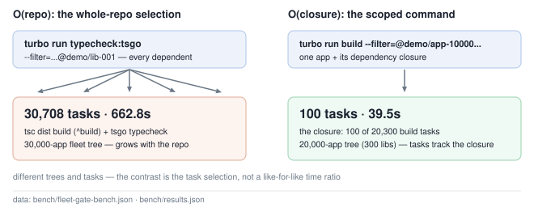
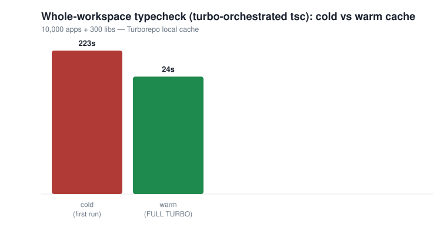
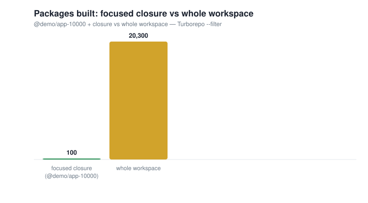
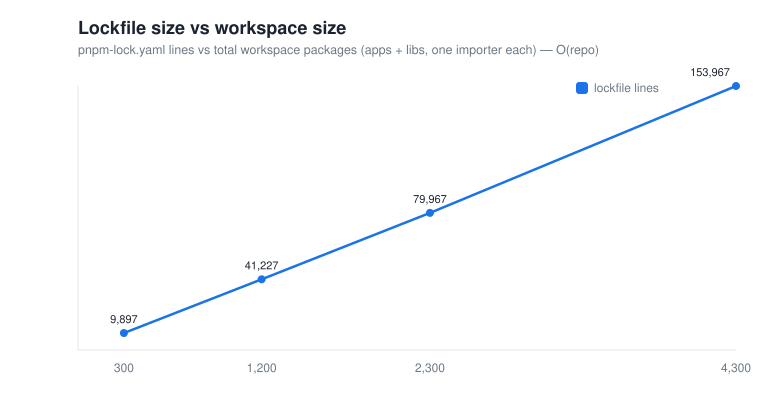
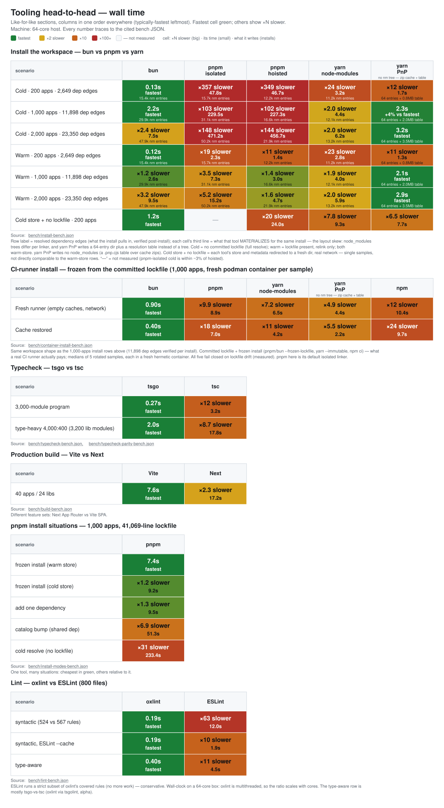

# Next.js Monorepo Scale Lab

Benchmark rig for a pnpm + Turborepo workspace of N Next.js apps and M shared libraries, with a layered dependency graph, measured to 20,000 apps / 300 libs (whole-workspace tsc typecheck to 10,000 apps; test-execution axis to 1,000 apps / 200 libs).

Whole-workspace operations (install, typecheck, warm `turbo run`, `turbo prune`'s graph load) scale with package count. A focused build (`turbo run --filter=<app>...`) executes one app's dependency closure — 75–124 packages at every measured scale, 100 of 20,300 at the top — so its task count tracks the closure, not app count. Its wall time is not flat: ×4.8 across 100× apps (8.3s → 39.5s), the whole-graph load every turbo invocation pays. Avoid unscoped whole-repo execution. Numbers in [Results](#results-scaling-behavior).



[High-resolution PNG](bench/charts/fig-orepo-oclosure.png)

**Figure 1.** A command whose selection is the whole repo — here the fleet gate, a filter on the foundation lib that selects every dependent — runs a task count that tracks repo size; a command filtered to one app selects that app's dependency closure, so its task count tracks that closure. The two sides are different trees on different machines (the 64-core fleet-gate record, the 192-core scaling record); the filtered command's wall time also carries a per-invocation graph load that grows with the repo ([Results](#results-scaling-behavior)).

Three layers of focus: install-time (`pnpm deploy` / `turbo prune @demo/app-2000 --docker`), task-time (`turbo run build --filter=@demo/app-2000...`), artifact-time (`turbo prune ... --docker` → `out/`). Measured by `scripts/measure.mjs` → [`bench/results.json`](bench/results.json).

## The Workspace Under Test

The workspace-scaling numbers in these docs are measured on one generated workspace shape, scaled by `APPS`/`LIBS`:

- **N Next.js apps** (`apps/app-*`): App Router, one layout + one page each — deliberately tiny, so app *count* is the variable under test, not app size.
- **M shared TypeScript libs** (`packages/lib-*`): each holds 16 generated modules re-exported through `src/index.ts`, and builds to `dist/` with tsc (`dependsOn: ["^build"]`).
- **A layered lib graph**: libs split into 6 layers; each lib imports up to 3 libs from the layer directly below it, and layer-0 libs import nothing. The graph is a DAG — closure depth is bounded by the layer count, and closures overlap heavily (many features share the same low-layer libs).
- **Each app imports 4 libs** spread across the lib range; with transitive deps an app's closure is 75–124 packages at the measured scales.
- **An optional universal foundation tier** (`--universal K`): libs 1..K become pure sinks imported by every app and every other lib — the `@acme/core` everyone imports. Off in the scaling table below; the blast-radius benches (lib-rev, optimal-gate, test-axis, the remote-cache partial-invalidation rung) turn it on.
- **Internal deps** are `workspace:*` links; one pnpm catalog pins the Next/React/TS versions (`--versioned` switches to `workspace:^x.y.z`, see [WORKSPACE-VS-SEMVER.md](WORKSPACE-VS-SEMVER.md)).
- **A measured production shape** (`--preset fleet`): the skewed graph of a real fleet — 30,000 ~30-file apps over 460 libs, an apps-only universal tier, a semi-universal popular tier, 40% sink libs with deep narrow chains, variable fanout (median 14). Shape targets vs generated tree in [`bench/fleet-shape.json`](bench/fleet-shape.json); model, divergences, and how to run in [FLEET.md](FLEET.md).

At 100 libs / 6 layers the shape is:

```
apps     app-001 … app-N            each app imports 4 libs, from any layer
           │
           ▼
libs     layer 5   lib-086 … lib-100  ─┐
         layer 4   lib-069 … lib-085   │  each lib imports ≤3 libs
         layer 3   lib-052 … lib-068   │  from the layer directly
         layer 2   lib-035 … lib-051   │  below it
         layer 1   lib-018 … lib-034   │
         layer 0   lib-001 … lib-017  ─┘  imports nothing (sinks)

         --universal K:  libs 1..K imported by every app and every other lib
```

A few benches measure a different corpus and say so where they report: the million-module checker sweeps (one program, not a workspace), the lint corpus, the type-parity scaffold, and the real-app vet.

### Quick start

```bash
# 1. generate a workspace (start at 200–2,000 apps)
pnpm install
pnpm gen -- --apps 200 --libs 100 --modules 16 --clean
pnpm install

# 2. exercise the three focus layers
turbo run build --filter=@demo/app-00100...   # focus build (one app's closure)
turbo run typecheck                            # whole-workspace typecheck
turbo prune @demo/app-00100 --docker           # minimal deploy subtree
```

`generate.mjs` flags (defaults): `--apps` 50, `--libs` 50, `--modules` 16, `--app-deps` 4, `--lib-deps` 3, `--layers` 6.

## Results: Scaling Behavior

Measured on a 192-core c8g.48xlarge (arm64): Node 22, pnpm 12.8.1 (each row's `versions.pnpm`), Turbo 2.9.18, TypeScript 6.0.3 for the per-package `tsc` tasks. `bench/results.json` carries no machine fields; the 64-core records' machine is described under [The 64-Core Machine](#the-64-core-machine), not this record. A deliberate 12-thread nice-19 CPU keep-warm ran on the box during every bench of the 192-core `results` / `axis-bench` / `ci-cache-bench` / `ci-cache-network-bench` / `vite-task-bench` records; the three that capture load show a pre-run 1-minute load average of 13.5–25.8. Six scale points, 200 → 20,000 apps (100× apps, ~68× packages); the whole-workspace tsc typecheck runs through 10,000 apps and the sweep skips it at 20,000. The tsc/prune/focus columns via `scripts/measure.mjs` → `bench/results.json`; the `tsgo whole` column via `scripts/tsgo-scale-table-bench.mjs` → `bench/tsgo-scale-table.json` (same generator shape, also a 192-core c8g.48xlarge, typescript 7.0.2, per the record's `cores`/`versions`; its four points are 200 / 1,000 / 2,000 / 4,000 apps).

| apps (libs) | tsc cold¹ | tsc warm¹ | tsgo whole² | focus build³ | prune | build tasks | focus closure |
|---|---|---|---|---|---|---|---|
| 200 (100) | 8.4s | 1.0s | 0.33s | 8.3s | 0.5s | 300 | 75 |
| 1,000 (200) | 25.2s | 3.8s | 0.68s | 10.8s | 1.6s | 1,200 | 124 |
| 2,000 (300) | 46.6s | 5.2s | 1.01s | 11.9s | 1.9s | 2,300 | 100 |
| 5,000 (300) | 107.0s | 11.3s | — | 15.4s | 4.4s | 5,300 | 100 |
| 10,000 (300) | 222.8s | 23.9s | — | 22.2s | 11.8s | 10,300 | 121 |
| 20,000 (300) | — | — | — | 39.5s | 25.0s | 20,300 | 100 |

¹ `turbo run typecheck`: turbo-orchestrated tsc (a `tsc --noEmit` per package behind a tsc `^build`), cold then warm-cache hit. Not run at 20,000 apps (`scripts/sweep.mjs` omits the phase at its top scale).
² `tsgo whole` — the recommended checker: one `tsgo --noEmit` over the whole workspace from source (`@demo/*`→`packages/*/src`), median of 3, peak RSS 143→798 MB across its four points (`bench/tsgo-scale-table.json`; typescript 7.0.2). Its fourth point is 4,000 apps (1.47s), a scale this sweep does not run; it has no point at 5,000 apps or above. tsgo keeps no incremental cache, so this cold number is its steady state — faster than even the tsc *warm* hit (5.2× at 2,000 apps). Different mechanism than the tsc columns (one process, no dist build); the per-package turbo+tsgo path is priced in [OPTIMAL-STACK.md](OPTIMAL-STACK.md).
³ `turbo run build --filter=<one app>...` (app + library closure); generated source made visible to Turbo for the run so warm/graph-load numbers reflect real per-package hashing. Install measured separately in [TOOLING.md](TOOLING.md#install-bun-vs-pnpm-vs-yarn-4).

Scaling factor, 200 → 10,000 apps (50× apps, 34× packages), the range every tsc column covers; the 20,000-app factor is added where the phase ran:

| operation | factor | class |
|---|---|---|
| tsc cold | ×26.4 | O(repo); 20–22ms per package from 1,200 packages up |
| tsc warm | ×24.4 | O(repo); Turbo hashes every package on a full hit |
| tsgo whole | ×4.4 (200 → 4,000 apps) | O(repo), but sub-linear — program size grew ×7.4, startup amortizes |
| prune | ×21.6 (×45.6 to 20,000 apps) | O(repo); reads the whole graph |
| focus build | ×2.7 (×4.8 to 20,000 apps) | O(closure) work — the closure stays 75–124 packages — plus an O(repo) graph load per invocation |

The focused build's work stays one closure, but its wall time carries a repo-sized term. At the three scales where the closure is 100 packages (2,000 / 5,000 / 20,000 apps) the focused build takes 11.9s / 15.4s / 39.5s, and `turbo prune` of the matching 101-package subtree takes 1.9s / 4.4s / 25.0s: the two move together (+27.6s and +23.1s from 2,000 to 20,000 apps) because both load the whole graph before selecting a subset ([LIMITS.md](LIMITS.md), item 2). The whole-workspace type-error gate is cheap on the recommended checker: tsgo checks all 2,000 apps from source in **1.01s** (1.47s at 4,000), faster than even the tsc warm-cache hit; the turbo-orchestrated tsc column takes 46× as long cold at 2,000 apps (it also builds each lib's dist, work tsgo skips). So the gate stays O(repo) but in seconds, not minutes. At 20,000 apps the whole-workspace tsc typecheck is not run; extrapolating the 10,000-app per-package rates (21.6ms cold, 2.3ms on a full cache hit) gives ~7 minutes cold and ~47s warm on this box. The tsgo whole-program gate is measured to 4,000 apps; beyond that is extrapolation. What stays irreducibly O(repo) is in [LIMITS.md](LIMITS.md). To avoid the tsc-path O(repo) cost, scope with `--filter=<app>...` / `--affected`; an unscoped `turbo run` enumerates the whole graph even on cache hits. At 20,000 apps a scoped command already costs 23–28s more than the same-sized selection does at 2,000, so shard.

### Charts




### The 64-Core Machine

The 64-core records listed here were measured on a dedicated c7gd.metal — a 64-core Graviton3 (Neoverse-V1) with 125.5 GiB RAM (135 GB as `bench/env.json` counts it) and two local NVMe disks as a btrfs RAID0 at `/mnt/fcvm-btrfs` — with no other user or workload on it. The root volume is a 30 GB gp3 EBS volume (ext4) at its default provisioning of 3,000 IOPS and 125 MiB/s; podman's storage root is on the btrfs RAID0 (`/mnt/fcvm-btrfs/containers/storage`, overlay driver). Host toolchain: node 22.23.3, pnpm 12.8.1, bun 1.3.14, yarn 4.18.1, typescript 7.0.2 (the native compiler) with typescript 6.0.3 as the oracle; `bench/env.json` is this box's capture (CPU model, cores, memory, kernel, tool versions). Before each queued bench the queue ran a 45-second all-core burst, waited for the 1-minute load average to fall below 1.5, and then started the bench; nothing else ran during a bench. Those records that capture pre-run load show 1.2–1.4, the decaying average from that burst; `fs-iops-bench` records 0.96. No record carries the instance type, the root volume's provisioning, podman's storage location or this protocol; a record carries its core count, tool versions, and in places memory or filesystem fields, where its bench writes them.

- install family: `install-bench`, `install-modes-bench`, `lockfile-bench`, `focus-install-bench`, `lockfile-merge-bench`, `pnpm12-bench`, `container-install-bench`, `perf-matrix`
- filesystem and device: `fs-bench`, `fs-iops-bench`
- checkers, builds, tests: `typecheck-bench`, `typecheck-parity-bench`, `tsgo-scale-bench`, `lsp-scale-bench`, `tsgo-pnp-bench`, `real-app-bench`, `rspack-turbopack-speed-bench`, `rspack-pnp-bench`, `pnp-compat-bench`, `vite-plus-tools-bench`, `build-bench`, `turbopack-bench`, `test-axis-bench`
- fleet: `fleet-gate-bench`, `sliced-gate-bench`, `fleet-flow-bench` (their `.pbox.json` companions are the 192-core runs), `yarn-fleet-bench`

The 64-core records not listed are runs on a shared dev box of the same instance type, with other users' processes running. Four record tool behavior — exit codes, error codes, lockfile and manifest contents — and no timing: `wave-rollout-bench` (its install-speed text is derived from the two install records above), `bun-safety-bench`, `yarn-rollout-bench` and `decl-emit-caveat`. `fleet-shape` records graph metrics of the generated tree. `flow-wedge-retest` records a crash reproduction and the recheck times of the two Flow builds it compares.

## Day-to-Day Developer Simulation

`scripts/dev-sim.mjs`, D developers each owning two apps + one lib in a 1,000-app / 200-lib workspace (1,200 packages), `--devs 4 --apps 1000 --libs 200`:

| operation | cost |
|---|---|
| onboarding: build a feature area (apps + lib closure) | median 8.6s |
| typecheck-on-save: edit an app, typecheck it | median 2.6s |
| build-before-push: edit an app, build it + closure | median 5.0s |
| lib-edit: rebuild your lib + dependents (21 packages) | median 8.3s |
| independence: a teammate's unrelated edit | adds 0 rebuilds |
| edit foundation lib (`lib-003`, low layer) | 1,080 of 1,200 packages rebuild |
| edit high-layer lib (`lib-197`) | 21 packages rebuild |

The inner loop is O(closure); a teammate's unrelated app adds zero rebuilds; a low-layer foundation lib rebuilds ~90% — why foundation edits lean on the remote cache and CI `--affected`. Optimization playbook in [`OPTIMIZATIONS.md`](OPTIMIZATIONS.md).

## Artifacts

- One app [deployed to Vercel](https://nextjs-monorepo-scale-demo.vercel.app) (pruned subtree, cloud build; 22s wall; `bench/deploy.json`).
- Four packages published to AWS CodeArtifact for the diamond demo (`scripts/diamond-demo.sh`).

## Findings by Area

Each companion doc measures one cost, with the bench JSON behind it.

**When a shared workspace is worth it.** It fits apps that share code and versions: the daily loop's work is O(closure) (plus a per-command graph load that grows with the repo, [Results](#results-scaling-behavior)) and the heavy O(repo) costs land on rare events, amortized by the committed lockfile and remote cache. Wrong fit for independent apps. Decision table in [FEASIBILITY.md](FEASIBILITY.md).

### Tooling Head-to-Head

Fastest install depends on what is cached and on workspace size; tsgo runs ~8.8–12× faster than tsc. Regenerate with `node scripts/comparison-chart.mjs`.



> High-resolution PNG of the chart above: [`bench/charts/tool-comparison.png`](bench/charts/tool-comparison.png).

The chart below uses the same heat-table style for a different question: how tsgo, tsc, and Flow behave as one TypeScript program grows to a million modules (full analysis in [TYPECHECKERS.md](TYPECHECKERS.md)):


> High-resolution PNG of the chart above: [`bench/charts/checker-scale.png`](bench/charts/checker-scale.png). Regenerate with `make scale-chart`.

- **Install cost.** pnpm 12.8.1 (the Rust CLI) cold-installs the workspace in seconds — 0.43s → 6.8s isolated / 0.46s → 2.5s hoisted (200 → 2,000 apps) — because **the Rust rewrite removed the JS cold-resolve wall**: 331× faster cold resolve at 1,000:200 (307.4s → 0.93s), ~10× warm/frozen, same core `lockfileVersion: '9.0'` (a pnpm-10-authored lockfile installs frozen under 12, bytes unchanged), with one hardened fail-closed default measured (a blocked build script fails the install) and a second, time-dependent one the bench disables rather than probes (the supply-chain minimum-release-age gate) ([TOOLING.md](TOOLING.md#pnpm-12-the-rust-rewrite), `bench/pnpm12-bench.json`). The bun-vs-pnpm cold order depends on scale: bun ~1.6× faster at 200 apps (and ~1.7× truly-cold, 1.3s vs 2.2s), **pnpm-hoisted 3.1–3.4× faster than bun at the measured 1,000- and 2,000-app points** (pnpm-isolated is also ahead of bun at both, 1.3–1.4×; bun's cold is the slowest of the five configurations at 2,000); pnpm-hoisted is the fastest cold at both (0.96s, 2.5s), with pnpm-isolated second at 1,000 (2.1s) and yarn-PnP second at 2,000 (3.2s). A frozen install at 1,000 apps is 2.8s, 3% under a full re-resolve (2.9s; `bench/install-modes-bench.json`). Those are the 64-core install-family records ([the dedicated box](#the-64-core-machine)), to 2,000 apps. The 192-core scaling sweep (`bench/results.json`, a separate record: the catalog workspace, no lockfile, warm store) installs in 0.6s → 3.9s from 200 to 5,000 apps, then 31.3s at 10,000 and 74.9s at 20,000. ([FEASIBILITY.md](FEASIBILITY.md), [TOOLING.md](TOOLING.md))
- **CI-runner install (frozen, containers).** Five-way at 1,000 apps (pnpm 12.8.1 on its default isolated linker): **bun 0.93s and pnpm 1.03s fresh, 0.42s and 0.50s cache-restored — pnpm +11% / +19%**, yarn-PnP 4.5s/2.2s, yarn-nm 6.5s/4.2s, npm 10.4s/9.7s. All fail closed on lockfile drift. ([TOOLING.md](TOOLING.md))
- **yarn as rollout driver + PnP boundary.** yarn 4 runs every rollout mechanic natively (byte-identical resolves, `--immutable` fail-closed, CI auto-immutable, named catalogs, concrete-range `yarn pack`). Under PnP tsc/turbo/oxlint run; stock tsgo does not — the green path is the tsgo native PnP resolver ([typescript-go#460](https://github.com/microsoft/typescript-go/issues/460)). `next build` under PnP depends on the node version: on node 22.22.0 webpack and **rspack** build and Turbopack fails; on node 22.23.3 every builder crashes loading `next.config`. TypeScript 7 under PnP fails to install on yarn 4.17.0 and installs on 4.18.1. ([ROLLOUT.md](ROLLOUT.md), [TOOLING.md](TOOLING.md#yarn-pnp-toolchain-compatibility))
- **Vite Task (Vite+) vs Turborepo.** turbo wins whole-repo typecheck 3.2–10.7× (cold 8.4–10.7×, warm 3.2–4.1×; 192 cores, concurrency 192 on both runners). The focused warm loop is close: vp stays flat across 3× repo growth (0.81s → 0.83s) while turbo's grows (0.76s → 1.01s), so turbo leads at 300:100 and vp by 1.2× at 1,000:200; turbo's focused cold run is faster at both scales (1.4s vs 2.3s, 1.5s vs 2.0s). On the 1,200-task test run vp is 2.7× faster warm (1.0s vs 2.8s) and turbo 2.5× faster cold (7.1s vs 17.6s). vp is correct on gitignored/cross-package edits but refuses self-mutating tasks (`next build`, `vite build` uncacheable). ([TOOLING.md](TOOLING.md))
- **`node_modules` footprint & linker.** Under pnpm 12 the linker moves speed, and the direction differs between the measured workload shapes: hoisted cold is 2.2–2.7× faster than isolated at 1,000–2,000 apps and relinks warm 4.3–6.8× faster (`install-bench.json`, decataloged trees), while the 300:100 catalog workspace runs hoisted ~1.7× *slower* cold (1.06s vs 0.62s, one sample each) and its tree contains 4.3× as many `node_modules` entries (`perf-matrix.json`); in the install-bench trees hoisted contains fewer entries than isolated (17,786 vs 31,133 at 1,000 apps). The two records vary scale and catalog form together, so they do not isolate which causes either reversal. `isolated` 374,827 entries / 241,712 symlinks at 20,000 apps (`results.json`); PnP shrinks it to 64 unplugged entries + a 0.8–3.5 MB `.pnp.cjs`. ([OPTIMIZATIONS.md §1](OPTIMIZATIONS.md#1-install-time-pnpm), [TOOLING.md](TOOLING.md))
- **Lockfile.** Irreducibly O(repo): 10,185 → 746,255 lines (200 → 20,000 apps, 34–37 lines per package). A `catalog:` bump edits **0** app manifests (vs 25 pinned) but rewrites hundreds of lockfile lines; two concurrent bumps conflict (253 markers), `pnpm install` auto-resolves to 0. ([OPTIMIZATIONS.md §1.5](OPTIMIZATIONS.md#15-lockfile-churn-and-merge-conflicts), [LIMITS.md](LIMITS.md))
- **Type-checking.** Whole-repo typecheck (turbo-orchestrated tsc) O(repo): cold 8.4s → 222.8s, warm 1.0s → 23.9s (200 → 10,000 apps). tsgo — GA as `typescript@7`'s native `tsc` — ~12× faster per check, drop-in for modern configs. At a million modules tsgo checks in 70.7s at 53.7GB RSS; Flow completes the sweep at +31% of tsgo on a third the memory and its server answers one valid edit in **324ms at 1M** (flow-main build; released 0.321 crashes at scale) vs 2.5s for tsgo's LSP on a valid edit, which covers the open file only. Behind codegen, relay-compiler generates 10k artifacts in ~2.9s, tsgo then checks in 0.91s / Flow 1.7s. ([TYPECHECKERS.md](TYPECHECKERS.md))
- **Build.** On Next 16, Turbopack is already the default bundler, so `next build` and `next build --turbopack` run the identical build — the flag is redundant and the two measure the same. A Vite SPA builds ~3.2× faster with ~20× less output, but that is a different feature set (a client SPA, not Next's server rendering). ([OPTIMIZATIONS.md §3](OPTIMIZATIONS.md#3-nextjs-build-cost), [TOOLING.md](TOOLING.md))
- **Lint.** oxlint lints an 800-file corpus in **190ms** (full **598**-rule set); ESLint runs the **530**-rule subset in **9.6s** / **1.6s** cached — oxlint **50.5×** / **8.3×** faster. `oxlint --type-aware` flags `no-floating-promises` in **388ms** vs ESLint's **3.6s** (**9.2×**). ([TOOLING.md](TOOLING.md))
- **Test execution.** Whole-repo `turbo run test` is one task per package (400 at 300:100, 1,200 at 1,000:200; cold 3.7s → 12.3s, warm 1.8s → 4.7s). Scoping is O(closure): a focused closure is 124 of 1,200 tasks; a leaf-lib edit re-tests 21 vs a universal-foundation edit's 1,200 (~57× spread). ([LIMITS.md](LIMITS.md))
- **Focus / deploy.** `turbo prune` emits a complete subtree (0 of 15 packages missing) + a pruned lockfile (1,050 of 4,127 lines, pnpm 12.8.1) but omits root configs (`tsconfig.base.json`). One app deployed to Vercel in 22s. ([OPTIMIZATIONS.md §4](OPTIMIZATIONS.md#4-ci-and-deploy))
- **Semver vs `workspace:`.** `workspace:` forces local linking; `pnpm publish` rewrites it to a real range. Proven on CodeArtifact: a diamond keeps both majors under the isolated linker, a root override collapses it, and per-app transitive divergence needs a separate workspace + lockfile. The when-do-two-copies-exist rules (workspace-vs-registry edges, range convergence) in [§8](WORKSPACE-VS-SEMVER.md#8-when-two-copies-exist-and-when-they-converge). User stories in [STORIES.md](STORIES.md). ([WORKSPACE-VS-SEMVER.md](WORKSPACE-VS-SEMVER.md))
- **Optimal type-error gate (4k:400).** On bun + tsgo + oxlint + turbo: a whole-program gate over 4,000 apps runs in 1.59s; a breaking foundation signature is caught as every app red (4,399 `TS2554`). The fast `declaration:false` gate misses a `.d.ts` portability error the build catches. ([OPTIMAL-STACK.md](OPTIMAL-STACK.md))
- **Developer inner loops.** Per-role O(closure) loops on the optimal stack (app dev, lib dev), fresh vs subsequent: typecheck, lint, focused gate all in seconds. Also run on real apps (vercel/commerce, shadcn/taxonomy). ([SUMMARY.md](SUMMARY.md), [OPTIMAL-STACK.md](OPTIMAL-STACK.md))
- **Core-lib rollout.** The lockfile is the determinism boundary (frozen install makes the range form inert); bun drives it natively and wins the 200-app cold and truly-cold install cases, pnpm-hoisted is faster at the measured 1,000- and 2,000-app points, and bun leads the CI frozen container install (pnpm +11% fresh / +19% cache-restored). A universal lib is a republish-fanout; breaking changes go expand→migrate→contract. ([ROLLOUT.md](ROLLOUT.md))
- **bun adoption safety.** Adoptable with two real gaps (the built-in allowlist runs registry `postinstall` scripts pnpm 12 blocks, failing the install; no fail-closed strict-peer knob — pnpm 12 exits 1 with `ERR_PNPM_PEER_DEP_ISSUES` via its native config surface, `--config.strict-peer-dependencies=true`, while ignoring the npm-style `npm_config_` env surface pnpm 10 honored) plus pnpm's phantom-isolation edge in single-package projects. The rest is parity. ([ROLLOUT.md](ROLLOUT.md#adoption-safety), [SUMMARY.md](SUMMARY.md))
- **Remote cache (CI economics).** Turborepo caches each task's outputs (built files, the typecheck result) keyed by a hash of its inputs — the task's source, its dependencies' outputs, and global inputs like `tsconfig.base.json` and the pinned tool versions. A shared cache lets a later CI runner download an unchanged task's stored output instead of recomputing it, turning the O(repo) cold start into a restore (192-core box): typecheck **9.9s → 1.5s** (6.8×, 300:100) and **24.8s → 3.9s** (6.4×, 1,000:200), build **24.8s → 3.8s** (6.5×, 300:100). It only helps a task whose inputs are unchanged: after a leaf-lib edit **486 of 500** tasks still hit the cache, but a foundation-lib edit rehashes every dependent so **0 of 500** do. Across a 10-runner fleet it amortizes ~4.2×. ([LIMITS.md](LIMITS.md#remote-cache-amortizing-the-orepo-cold-start))
- **Editor / language server.** Opening one app is O(closure): the server loads its closure (65 libs / 1,123 files), flat as the repo grows 8×. tsgo's native LSP opens it in **113ms vs tsserver's 1,563ms** (13.8×) with **309 vs 414MB** RSS; warm, both answer def/hover in ≤2ms. ([LIMITS.md](LIMITS.md#editor-and-language-server))
- **The fleet shape.** `--preset fleet` regenerates a measured production fleet — 30,000 ~30-file apps / 460 libs, an apps-only universal tier, a semi-universal popular tier, 40% sink libs, depth-15 chains — with all 15 recomputed graph metrics inside tolerance. Measured at full scale (~1.03M generated files, 64-core box): one tsgo program type-checks the whole workspace from source in **58.1s** (**10.9×** faster than the per-package turbo pipeline's 633.9s / 30,708 tasks — not like-for-like: the pipeline also builds each lib's dist) and catches a breaking foundation rev with all 30,000 apps red in **58.9s**; on a 192-core box the one-program check does **not** get faster (66.6s) while the pipeline improves 1.8×. `make typecheck-whole` packages the one-command gate; slicing the same check into K concurrent per-subset programs cuts it to **10.3s** on 64 cores and **6.2s** on 192 (union-verified identical verdict — the box the one-program gate wastes becomes the fastest way to run it) ([FLEET.md](FLEET.md#the-sliced-gate-using-the-whole-box), `bench/sliced-gate-bench.json`, `bench/sliced-gate-bench.pbox.json`). ([FLEET.md](FLEET.md), `bench/fleet-gate-bench.json`, `bench/fleet-gate-bench.pbox.json`)
- **Flow on the fleet shape.** A Flow-dialect mirror of the fleet (876,440 files, the same workspace import graph — both checkers flag exactly 30,171 call sites on the breaking rev — though a smaller ambient surface than the TS program): Flow's batch check is 1.4× slower than tsgo (79.7s vs 58.1s) at **2.6× less memory** (20.1GB), and its resident server answers the full 30,000-apps-red breaking verdict **incrementally in 14.9s** (45ms when nothing changed) — a server-style incremental verdict tsgo does not have (its resident `--watch` re-checks in ~23s on the separate 1M-file corpus). ([TYPECHECKERS.md](TYPECHECKERS.md#flow-on-the-fleet-shape), `bench/fleet-flow-bench.json`, `bench/fleet-flow-bench.pbox.json`; the tsgo side is `bench/fleet-gate-bench.json`)
- **yarn 4 at fleet scale.** PnP installs the 30,460-package workspace truly-cold in **41.2s** (one 62MB `.pnp.cjs`; the node-modules farm it replaces is 4.88M entries, 203.5s), and a native-PnP tsgo build runs the whole-program gate through it in **57.9s vs 57.4s for the same binary over node-modules** — one timed run per linker, 0.8% apart. Stock tsgo still fails PnP (30,000 × TS2503). ([TOOLING.md](TOOLING.md#yarn-pnp-toolchain-compatibility), `bench/yarn-fleet-bench.json`)
- **The ceiling.** What focus, cache, and `--affected` cannot remove at ~20,000 apps: the single lockfile, the per-command Turbo graph-load floor, foundation blast radius (~90% of packages), inode/disk pressure, language-server memory, git worktree cost, Vercel's per-project model. Past this, shard or move to a daemon + remote-execution build system. ([LIMITS.md](LIMITS.md))

Methodology and grounding: [GROUNDING.md](GROUNDING.md) maps each practice to its primary source; [REVIEW.md](REVIEW.md) is the quality pipeline every change runs through.

## License

MIT, see [LICENSE](LICENSE).
