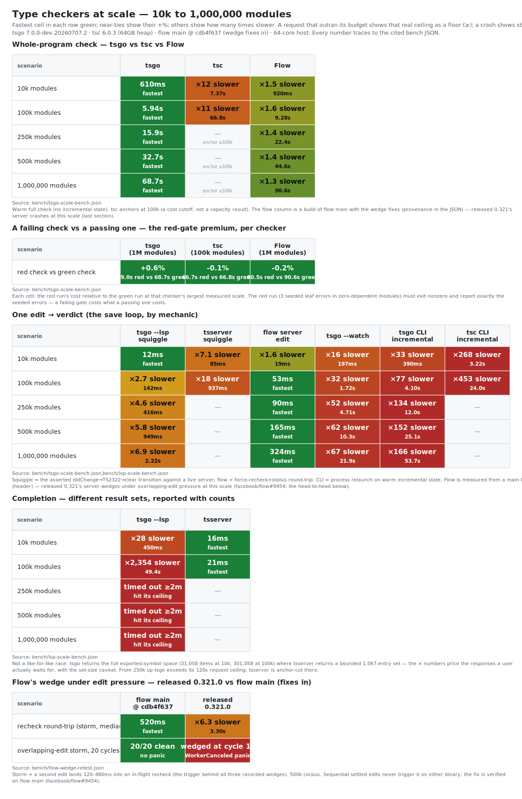

# Faster type-checking

```
  one program, 100 layers deep, growing 100× wide            one edit at 1,000,000 modules
                                                             (save loop, by mechanic)
  layer 99  ● ● ● ● ● ● ● ●   ← leaves: nothing imports
     ⋮        ╲ ╲ │ ╱ ╱           them (red-gate seeds)      flow server   ▏0.32s
  layer  1  ● ● ● ● ● ● ● ●   each module imports ≤3         tsgo --lsp    ▌2.2s
  layer  0  ● ● ● ● ● ● ● ●   from the layer below           tsgo --watch  █████▌21.9s
            10k ═══════════► 1,000,000 modules               tsgo CLI      █████████████▌53.7s

  whole-program check: tsgo 0.61s → 68.7s (≈linear) · Flow full sweep, +32% at 1M at a
  third of the RAM · tsc 11× at its 100k anchor · a FAILING check costs what a passing
  one costs
```

Each package runs `tsc --noEmit`, fanned out and cached by Turborepo. Whole-repo type-checking is O(repo), so the first lever is checking less (`turbo --affected`); the second is making each check cheaper.

## Measured: tsc vs tsgo

`scripts/typecheck-bench.mjs` generates N cross-referencing modules in one program and times `--noEmit` for tsc and for tsgo (the TypeScript native Go port, shipped as `@typescript/native-preview`); each number is the median of 5 timed runs after a discarded warmup.

| modules | tsc | tsgo | speedup |
|---|---|---|---|
| 3,000 | 3,101ms | 255ms | 12.2x |

Consistent with Microsoft's ~10x claim. tsgo runs as `tsgo --noEmit` and fits the existing per-package Turborepo task; it is drop-in for modern configs — those not relying on the options TS 7 drops (below).

tsgo is beta as of 2026-06 — only `7.0.0-dev.*` nightlies, no GA. The native port drops some legacy configuration (it discourages bare `baseUrl` resolution and drops `moduleResolution: node10` and older `target`s such as `es5`) and has no compiler/LSP plugin API yet; confirm the specifics against the TS 7 release notes (linked below) before adopting. Pin a nightly and keep tsc as the CI fallback.

## Behavior at a million files: tsgo vs tsc vs Flow (`scripts/tsgo-scale-bench.mjs`)

The scaling question the table above cannot answer: what happens as ONE program keeps
growing — 10k, 100k, 250k, 500k, 1,000,000 modules? This bench sweeps that range for
three checkers: **tsgo** (the subject), **tsc** (the baseline, anchored at 10k and 100k —
a cost cutoff, not a capacity result), and **Flow** (Meta's checker, built for exactly
this scale).¹ Data: `bench/tsgo-scale-bench.json`; 64-core arm64 box, corpus
on the btrfs NVMe mount (recorded in the JSON).



> High-resolution PNG of the chart above: [`bench/charts/checker-scale.png`](bench/charts/checker-scale.png). Regenerate both with `make scale-chart`.

The corpus is layered with **fixed depth**: modules sit in 100 layers, each importing up to 3
from the layer below (layer 0 imports nothing), so depth stays constant while width grows to 1M — the wide-not-deep
geometry real monorepos have. The shape is load-bearing: a chain whose depth grows with N
(typecheck-bench's shape) **stack-overflows tsc's incremental change propagation at
~5,000 modules** (`RangeError: Maximum call stack size exceeded`, reproduced — recorded
as `chainShapeNote`), so a depth-growing corpus would measure recursion depth, not
program size. The Flow corpus mirrors the TS one module-for-module in Flow's dialect.

Six rows per checker, each answering for a person: **cold** (page caches dropped before
every sample + no saved state — the fresh CI runner), **full** (caches warm, no saved
state — the recurring pre-merge gate), **incrNoChange** (warm incremental state, nothing
edited — the no-op floor), **incrOneEdit** (one private-const edit to a mid-corpus
module — the typecheck-after-save loop, at its minimal-invalidation floor), and the two
red paths: **fullWithLeafErrors** (the same full check over a corpus carrying 3 type
errors in leaf modules — the failing gate; the run must go red and report exactly the
seeded errors) and **incrOneEditError** (one leaf edit that introduces a type error —
the after-save loop when the change is wrong; each sample re-greens untimed first, so
the timed run measures error discovery, never diagnostic replay from saved state). Each checker
runs its own best mechanic: tsgo as the directly-resolved native binary, tsc under a
64GB node heap ceiling (parity-restoring vs the Go/OCaml runtimes' unbounded heaps),
Flow's batch rows via one-shot `flow check` and its incremental rows via its persistent
server (`serverInitMs` is the recorded boot; the ts checkers' recorded `incrPrimeMs` is
the equivalent entry cost). The incremental rows therefore pit Flow's primary mechanic
(a live server RPC) against the ts checkers' CLI mechanic (process relaunch +
tsbuildinfo) — different questions, labeled as such in the JSON; the ts daemons at THESE scales are
measured below ("The daemons at a million files"); the monorepo editor loop on one
app's closure is LIMITS.md's editor section.

Every timed number sits behind gates: a seeded type error must turn each checker red,
and the program must count exactly N source files (`--listFiles` / `flow ls`) — a
checker that no-ops or skips files cannot post a fast time. A crash signal or timeout anywhere
(including the gates) records a capacity boundary and stops that checker's sweep while
the others continue — none fired in the recorded dataset: every checker completed every
row it ran (tsc's anchor is a cost cutoff, not a death).

### Full check (the pre-merge gate), median wall time

| modules | tsgo full | tsgo cold | tsc full | flow full | flow cold |
|---|---|---|---|---|---|
| 10,000 | 0.61s | 0.94s | 7.4s | 0.92s | 1.05s |
| 100,000 | 5.9s | 7.3s | 66.8s | 9.3s | 9.5s |
| 250,000 | 15.9s | 19.9s | anchor cutoff | 22.4s | 22.7s |
| 500,000 | 32.7s | 41.8s | — | 44.6s | 45.5s |
| 1,000,000 | 68.7s | 89.8s | — | 90.6s | 90.8s |

¹ Flow is measured from a main-branch build (`versions.flow` records the commit);
released 0.321's server has a crash at this scale, fixed upstream — the last section.

tsgo checks the million-module program in **68.7s warm, 89.8s truly cold** — and its
scaling is near-linear across the 100× range: 61ms per thousand modules at 10k grows
only to 69ms at 1M (~13% superlinear drift). Flow completes the full sweep — +51% of
tsgo at 10k, +32% at 1M (90.6s vs 68.7s) — while the tsc anchor at 100k (66.8s vs
tsgo's 5.9s, 11×) is a cost cutoff so the tsc column never slows the sweep. The cold
tax — reading a million source files off NVMe with empty caches — is +31% for tsgo and
within noise for Flow (its server-spawn-plus-init dominates the one-shot either way).
One boundary: tsgo's CPU utilization spans ~490–920% across every row and scale — 5–9
of the 64 cores, so a bigger box buys nothing past that; the scaling curve above is
what its parallelism delivers.

### The red paths: checking a program that has type errors

The rows above run green. The red rows seed real type errors into leaf (top-layer,
zero-dependents) modules — the developer's own broken new code — and require the run to
exit red reporting exactly the seeded errors. **The failing gate costs what the passing
one costs, for every checker at every measured scale**: tsgo 69.0s red vs 68.7s green
at 1M (+0.6%), tsc 66.7s vs 66.8s at 100k, flow 90.5s vs 90.6s at 1M. Diagnostic
construction is not a cost axis at this corpus's error counts; budget for the check,
not for the failure.

### Memory

| modules | tsgo peak RSS (full) | tsc peak RSS (full) | flow server tree peak |
|---|---|---|---|
| 10,000 | 581MB | 826MB | 890MB |
| 100,000 | 5.4GB | 6.7GB | 2.4GB |
| 500,000 | 27.7GB | — | 9.0GB |
| 1,000,000 | 53.7GB | — | 17.1GB |

Memory is the axis where the checkers differ most: tsgo holds ~54KB per module (53.7GB
at 1M — 40% of this 135GB box, `bench/env.json`), Flow ~17KB per module (17.1GB at 1M,
a process-tree VmHWM sum — an upper bound), and tsc ~67KB per module at its 100k anchor
(measured under the 64GB heap ceiling, where V8 collects lazily — an upper bound, not
minimum footprint; the JSON's `tscNote`). No checker hit a memory cliff at any point on
this box.

### The developer loops

| modules | tsgo incr no-change / one-edit | tsc incr no-change / one-edit | flow status / edit round-trip |
|---|---|---|---|
| 10,000 | 0.34s / 0.39s | 3.0s / 3.2s | ~0ms / 19ms |
| 100,000 | 3.0s / 4.1s | 22.7s / 24.0s | 10ms / 53ms |
| 250,000 | 8.7s / 12.0s | — | 10ms / 90ms |
| 500,000 | 17.9s / 25.1s | — | 20ms / 165ms |
| 1,000,000 | 37.7s / 53.7s | — | 30ms / **324ms** |

The save-loop verdict splits by mechanic, exactly as the row labels warn. tsgo's CLI
incremental — relaunch and re-validate saved state against a million-file program —
costs 37.7s even when NOTHING changed, and 53.7s for one edit: at this scale the
process-relaunch mechanic is a CI tool, not a save loop (its daemon counterpart is
measured below, "The daemons at a million files"). Flow's persistent server answers a
no-change status in 0–30ms flat at every scale and **one edit in 324ms at a million
modules** — the fastest save loop measured in this bench, growing gently with N (19ms →
324ms across 100×). When the edit is WRONG, discovery costs about the same: tsgo 56.3s
vs 53.7s clean at 1M, tsc 23.4s vs 24.0s at 100k, flow 688ms vs 324ms at 1M (sub-second
either way). The entry costs are symmetric and recorded: tsgo's incremental prime is
94.8s at 1M, Flow's server init 90.5s (its init IS a full check). The tsc anchor adds
one observation: its one-edit re-check costs barely more than its no-change floor
(24.0s vs 22.7s at 100k — a third of the 66.8s full run), so the relaunch + buildinfo
floor dominates, not the edit — and its incremental engine is also the component that
stack-overflows on depth-growing graphs (the chainShapeNote above).

### The daemons at a million files (`scripts/lsp-scale-bench.mjs`)

The rows above measure CLI mechanics; the ts mechanic that matches Flow's server is a
persistent daemon. `bench/lsp-scale-bench.json` races **tsgo `--lsp`** against
**tsserver** (anchored ≤100k, the same cost cutoff as tsc) and **`--watch` mode** on
the same corpus shape, with the squiggle transitions asserted (a didChange introducing
a seeded error must pull TS2322, the restore must pull clean — both timed):

| modules | tsgo lsp cold open | tsgo lsp squiggle appear | tsserver cold open / squiggle | tsgo --watch first build / re-check |
|---|---|---|---|---|
| 10,000 | 0.18s | 12ms | 3.3s / 85ms | 0.66s / 0.20s |
| 100,000 | 1.4s | 142ms | 24.6s / 937ms | 6.5s / 1.7s |
| 250,000 | 4.0s | 416ms | anchor cutoff | 17.8s / 4.7s |
| 500,000 | 8.3s | 949ms | — | 38.8s / 10.3s |
| 1,000,000 | 17.5s | 2.2s | — | 82.0s / 21.9s |

**tsgo's LSP opens and serves the million-module program.** Cold open is 17.5s where
its own incremental prime is 94.8s; the squiggle round-trip is 2.2s (appear) / 2.0s
(clear) with definition at 248ms and hover at 1ms; peak RSS 66.1GB — 23% above the
batch check's 53.7GB. Against tsserver the gap is 17× on cold open (1.4s vs 24.6s at
100k) and ~7× on the squiggle (142ms vs 937ms). Watch mode is the middle mechanic:
`tsgo --watch` re-checks one edit in 21.9s at 1M (82.0s first build, 75.3GB — the
heaviest footprint measured), 2.5× faster than the CLI relaunch but not a save loop;
`tsc --watch` anchors at 76.3s first build / 2.3s re-check at 100k. Flow's server
(previous section) beats them all on the edit loop — 324ms at 1M.

One capability boundary: **tsgo's LSP completion grows with program size** — it
returns the full exported-symbol space (31,058 items at 10k in 450ms; 301,058 items at
100k in 49.4s) and exceeds the probe's 120s ceiling from 250k up, while tsserver
returns a bounded 1,067-entry set in 16–21ms at both its anchored scales. The set
sizes differ by orders of magnitude, so the times are not a like-for-like race
(reported with their item counts, the completion convention in this repo); the
boundary stands regardless — at 250k+ the preview daemon cannot answer the completion
request within 120s.

### Codegen in front of the checkers: Relay at 10,000 components (`scripts/relay-codegen-bench.mjs`)

Real product code at scale rarely feeds a checker directly — a codegen stage sits in
front. Relay is the canonical case in the tsgo/flow world: `relay-compiler` (Rust)
extracts `graphql\`\`` literals, validates them against a schema, and emits one typed
artifact per query in **either dialect** (`language: "typescript"` or `"flow"`). The
bench scaffolds the same 10,000-component tree in both dialects against a shared
100-type schema — every component imports and uses its query's generated `$data`
type, so the check validates codegen output against hand-written code — and times the
pipeline (`bench/relay-codegen-bench.json`; relay-compiler 21.0.1; flow = the same
main build as above):

| stage | typescript → tsgo | flow → flow |
|---|---|---|
| codegen, cold (10,000 artifacts) | 3.9s | 4.4s |
| codegen, no-change rerun | 3.9s | 3.9s |
| whole-tree check (components + artifacts, ~20k files) | **0.71s** (834MB) | **1.6s** |

Two findings. **The codegen stage dominates the pipeline**: relay-compiler costs ~4s
to the checkers' 0.7–1.6s — the checker is not the bottleneck behind a codegen step at
this scale, and Relay's no-change rerun costs the same as cold — a one-shot invocation
re-extracts and re-validates every document even with all artifacts present. And a
**dialect-skew gate**: relay-compiler 21's flow artifacts still use the `+` variance
sigil, which current Flow — released 0.321 and main alike — rejects as
`unsupported-syntax`; checking Relay's flow output today requires
`[options] experimental.deprecated_variance_sigils.excludes=<PROJECT_ROOT>/src/__generated__`
in `.flowconfig` (recorded as `flowConfigNote`; a schema-invalid query failing codegen
and a type misuse of a generated `$data` type failing each checker are the bench's
positive controls).

### Released 0.321's server crash-wedge (fixed on main)

Every released Flow binary through 0.321 carries a recheck-cancellation race that
wedges its server at this bench's scale (hence the main-build measurement): an edit
landing mid-recheck sends `WorkerCanceled` down an error channel whose consumers assume
only speculation errors can arrive; a worker panics, the files-completed counter
starves, and the master parks every thread against a healthy RPC socket. The symptom is
a **silently hung client** — `flow status` sits forever, and only process-level
inspection distinguishes "still checking" from "dead". The race fired in three of five
full-scale sweeps of this bench on 0.321 (server logs, `/proc`+gdb forensics, and the
recorded bench outcome archived in `bench/flow-0321-wedge-evidence.md`); the directed
retest (`scripts/flow-wedge-retest.mjs`
→ `bench/flow-wedge-retest.json`) wedges released 0.321.0 on demand at storm cycle 13
while the main build survives all 20 cycles. Reported upstream as
[facebook/flow#9454](https://github.com/facebook/flow/issues/9454); the fixes are on
main, unreleased as of 0.321. Main's recheck round-trips are also ~6×
faster than 0.321's on the identical corpus (0.3–0.7s vs 2.0–3.5s per storm cycle,
`bench/flow-wedge-retest.json`) — the recheck path was rebuilt, not just unwedged.

Per persona, at one million modules: the **fresh CI runner** pays 89.8s (tsgo) or 90.8s
(flow main) for the first check; the **gate owner** pays 68.7s (tsgo) or 90.6s (flow)
per whole-program run, red or green, and budgets 53.7GB or 17.1GB of RAM respectively;
the **developer on save** has two interactive mechanics — Flow's server (324ms per
edit, the fastest measured) and tsgo's LSP (2.2s per edit) — while `--watch` (21.9s)
and the CLI incremental (53.7s) are not save loops at this scale. tsgo's practical
limits at 1M are memory (53.7GB batch, 66.1GB LSP, 75.3GB watch; the CLI incremental
peaks lower at 42.6GB), entry cost (17.5s LSP open; 94.8s incremental prime), and the
LSP completion boundary.

## Ranked levers

1. tsgo (`@typescript/native-preview`): ~10x per check, drop-in. Beta, so pin a nightly and keep a fallback.
2. Cheap, stable config: `skipLibCheck: true`; `incremental: true` with an explicit `tsBuildInfoFile` added to Turborepo `outputs`; `"types": []` then list only what each package needs; `turbo --affected` so CI checks changed packages only.
3. Do not adopt TypeScript project references with Turborepo. Turborepo recommends against them (a second config plus a second cache layer), and `composite` forces `.d.ts` emit on every package, making each task heavier than `--noEmit`.

Honorable mention: `isolatedDeclarations` (TS 5.5) enables parallel `.d.ts` emit. Relevant only where declarations are emitted (the library builds here do; the app `--noEmit` checks do not).

Not type checkers: swc, esbuild, oxc, and Biome transpile or lint; they do not do semantic type-checking. stc is archived; ezno is experimental. tsc and tsgo are the complete options.

Sources: [TypeScript native port](https://devblogs.microsoft.com/typescript/typescript-native-port/), [TS 7 beta](https://devblogs.microsoft.com/typescript/announcing-typescript-7-0-beta/), [Turborepo TS guide](https://turborepo.dev/docs/guides/tools/typescript), [Performance wiki](https://github.com/microsoft/TypeScript/wiki/Performance).
