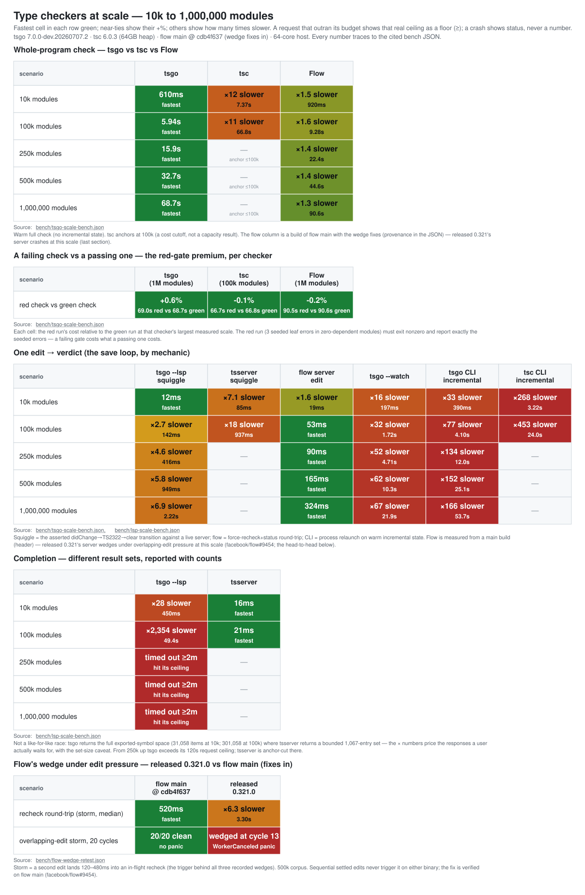

# Faster Type-Checking

Each package in [the workspace under test](README.md#the-workspace-under-test) runs `tsc --noEmit`, cached by Turborepo. Whole-repo type-checking is O(repo): the first lever is checking less (`turbo --affected`), the second is making each check cheaper.

## tsc vs tsgo

`scripts/typecheck-bench.mjs` times `--noEmit` over one N-module program (median of five runs) for tsc and tsgo (the native Go port, `@typescript/native-preview`).

| modules | tsc | tsgo | speedup |
|---|---|---|---|
| 3,000 | 3,101ms | 255ms | 12.2x |

Consistent with Microsoft's ~10x claim. `tsgo --noEmit` drops into the per-package Turborepo task for modern configs. Beta as of 2026-06 (`7.0.0-dev.*` nightlies, no GA), it drops some legacy config (bare `baseUrl`, `moduleResolution: node10`, older `target`s) and has no plugin API. Pin a nightly, keep tsc as the CI fallback.

## Behavior at a Million Files: tsgo vs tsc vs Flow

`scripts/tsgo-scale-bench.mjs` sweeps ONE growing generated program (a standalone corpus, not the workspace) through 10k, 100k, 250k, 500k, 1,000,000 modules for **tsgo**, **tsc** (anchored ≤100k), and **Flow**.¹ `bench/tsgo-scale-bench.json`; 64-core arm64.

> High-resolution PNG: [`bench/charts/checker-scale.png`](bench/charts/checker-scale.png) (`make scale-chart`).

The corpus is **fixed-depth**: 100 layers, each importing ≤3 from the layer below, so width grows to 1M while depth stays constant (real-monorepo geometry). Six rows per checker (cold, full, incrNoChange, incrOneEdit, two red paths), gated on a red seed + exact `--listFiles`/`flow ls` count.

### Full Check, Median Wall Time

| modules | tsgo full | tsgo cold | tsc full | flow full | flow cold |
|---|---|---|---|---|---|
| 10,000 | 0.61s | 0.94s | 7.4s | 0.92s | 1.05s |
| 100,000 | 5.9s | 7.3s | 66.8s | 9.3s | 9.5s |
| 250,000 | 15.9s | 19.9s | anchor cutoff | 22.4s | 22.7s |
| 500,000 | 32.7s | 41.8s | — | 44.6s | 45.5s |
| 1,000,000 | 68.7s | 89.8s | — | 90.6s | 90.8s |

¹ Flow is a main-branch build; released 0.321's server crashes at this scale (last paragraph).

tsgo is **near-linear** (61ms/thousand at 10k → 69ms at 1M; 68.7s warm, 89.8s truly cold at 1M). Flow's full sweep is +32% of tsgo at 1M (90.6s vs 68.7s); the tsc anchor at 100k is 11× (66.8s vs 5.9s).

### Red rows, memory, developer loops

- **A failing gate costs what a passing one costs**: tsgo 69.0s red vs 68.7s green at 1M (tsc, flow likewise flat).
- **Memory** (peak RSS, full): tsgo ~54KB/module (53.7GB at 1M), Flow ~17KB/module (17.1GB), tsc ~67KB/module at its 100k anchor (6.7GB); no memory cliff on this 135GB box.
- **Save loop** splits by mechanic: tsgo's CLI incremental costs 37.7s no-change / 53.7s one-edit at 1M — a CI tool, not a save loop. Flow's persistent server answers **one edit in 324ms at 1M** (19ms → 324ms across 100×), the fastest measured.

### The daemons and codegen

**Daemons** (`scripts/lsp-scale-bench.mjs` → `bench/lsp-scale-bench.json`): tsgo's `--lsp` serves the million-module program (17.5s cold open, 2.2s squiggle, 66.1GB RSS), **17× faster cold open than tsserver at the 100k anchor** (1.4s vs 24.6s). tsgo LSP completion grows with N (301,058 items at 100k, past the 120s ceiling from 250k up); tsserver stays ~1,067 items in 16–21ms.

**Codegen** (`scripts/relay-codegen-bench.mjs` → `bench/relay-codegen-bench.json`): relay-compiler over a 10,000-component tree in both dialects — codegen (~4s) dominates the checker (0.69s tsgo / 1.5s Flow — released 0.321 here; the main-branch build matters only at wedge scale). The checked-in-artifacts discipline holds up: relay's output is byte-stable on every timed no-change rerun, so a CI freshness gate (codegen + `git status --porcelain` over `__generated__` — status, not plain diff, so new untracked artifacts are caught too) costs 3.8s at 10k components and detects an edited query; the 30,000-component fleet anchor prices the same git-tracked freshness pass at 12.8s (codegen 12.75s + status 0.03s; 12.7s cold, one sample) — committing artifacts keeps the type gate build-free for ~13s of CI per pass.

Released Flow through 0.321 has a recheck-cancellation race that silently wedges its server at this scale (3 of 5 sweeps; [facebook/flow#9454](https://github.com/facebook/flow/issues/9454), fixed on main; retest `scripts/flow-wedge-retest.mjs`, evidence `bench/flow-0321-wedge-evidence.md`). The editor loop on one app's closure is in [LIMITS.md](LIMITS.md#editor-and-language-server).

## Flow on the Fleet Shape

`scripts/fleet-flow-bench.mjs` mirrors the measured fleet workspace ([FLEET.md](FLEET.md), 30,000 apps / 460 libs) in Flow's dialect — every workspace module plus a typed entry per app, 876,440 `// @flow` files derived from the generated tree's own manifests, so every workspace import edge (including the oven-sh/bun#36386 app rename) carries over. It is not file-for-file: the mirror omits each app's Next layout and the Next/React ambient type surface the TS program carries (~936k workspace files plus external `.d.ts`), so the time and memory rows compare Flow's mirror against tsgo's somewhat larger program. The workspace graph's fidelity shows in the breaking rev: **both checkers flag exactly 30,171 call sites** in their own dialects. App entries are typed function compositions, not JSX; package imports resolve via `module.name_mapper`, no install; the checker is the Rust-port build with the wedge fixes, provenance recorded. `bench/fleet-flow-bench.json` (64-core) and `bench/fleet-flow-bench.pbox.json` (192-core; run with `FLEET_FLOW_WORK` overridden, otherwise identical knobs):

| row | tsgo (fleet gate) | Flow, 64-core | Flow, 192-core |
| --- | --- | --- | --- |
| whole-program check | **60.7s** / 51.3GB | 79.5s / **20.1GB** | 77.7s / 22.7GB |
| breaking rev → 30,000 apps red (batch) | **59.5s** | 89.8s | 77.0s |
| server init (one-time) | — | 80.0s / 20.1GB | 80.8s / 22.7GB |
| status, nothing changed | — | **45ms** | 52ms |
| foundation edit, stays green | — | 10.0s | 15.6s |
| **foundation edit → 30,000 apps red (incremental)** | — | **14.9s** | 12.9s |

Three findings. tsgo wins the batch rows (1.3× on the check, 1.5× on the batch breaking rev) in the fleet's actual dialect; Flow holds the mirrored program in **2.5× less memory**. Flow's resident server changes the foundation owner's loop: the full-fleet breaking verdict costs **14.9s incrementally** against tsgo's 59.5s-per-run batch — tsgo's resident mechanics today are its `--watch` (~22s per re-check at the million-file scale) and its LSP (an editor server, not a batch verdict); upstream's incremental work targets tsc parity, not server-style incrementality (see the daemons section). The 192-core box moves Flow's rows between −8% and +14% and tsgo's not at all — neither scales with cores at this shape, matching the fleet gate's cross-machine result. A universal-lib edit costs 10–15s even incrementally: blast radius binds every checker; the sub-second edit loops measured at 1M modules were minimal-invalidation edits (a non-exported const on a mid-corpus module, and an error seeded in a zero-dependent leaf — nothing downstream to recheck), where the fleet rev changes an exported surface every app imports.

## Ranked Levers

1. tsgo (`@typescript/native-preview`): ~10x per check, drop-in; pin a nightly, keep a fallback.
2. Cheap config: `skipLibCheck: true`; `incremental: true` with `tsBuildInfoFile` in Turborepo `outputs`; `"types": []`; `turbo --affected`.
3. Do not adopt TS project references with Turborepo (a second config + cache layer; `composite` forces `.d.ts` emit on every package, heavier than `--noEmit`).

`isolatedDeclarations` (TS 5.5) enables parallel `.d.ts` emit, only where declarations are emitted (library builds). swc/esbuild/oxc/Biome transpile or lint, not type-check; stc is archived, ezno experimental — tsc and tsgo are the complete options.

**Sources:** [TypeScript native port](https://devblogs.microsoft.com/typescript/typescript-native-port/), [TS 7 beta](https://devblogs.microsoft.com/typescript/announcing-typescript-7-0-beta/), [Turborepo TS guide](https://turborepo.dev/docs/guides/tools/typescript), [Performance wiki](https://github.com/microsoft/TypeScript/wiki/Performance).
