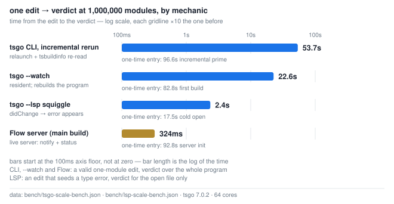
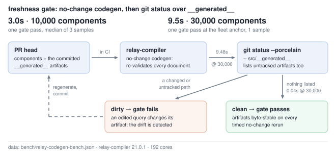

# Faster Type-Checking

Each package in [the workspace under test](README.md#the-workspace-under-test) runs `tsc --noEmit`, cached by Turborepo. Whole-repo type-checking is O(repo): the first lever is checking less (`turbo --affected`), the second is making each check cheaper.

## tsc vs tsgo

`scripts/typecheck-bench.mjs` times `--noEmit` over one N-module program (median of five runs) for tsc and tsgo (the native compiler, shipped since GA as `typescript@7` with a native `tsc` binary; the tsc column is TypeScript 6, the last JS release, installed as the `typescript6` alias — the oracle).

| modules | tsc | tsgo | speedup |
|---|---|---|---|
| 3,000 | 3,062ms | 257ms | 11.9x |

Consistent with Microsoft's ~10x claim. The native `tsc --noEmit` drops into the per-package Turborepo task for modern configs. TypeScript 7 is GA: it ships as `typescript` (this repo pins `7.0.2` exactly) with a native `tsc` — the tsgo name is retired, though this repo keeps `tsgo` as the task/record label. It drops some legacy config (bare `baseUrl`, `moduleResolution: node10`, older `target`s), has no plugin API, and ships no tsserver. TypeScript 6 is the last JS release; keep it installed (here as the `typescript6` alias) for tsserver and as the oracle checker. With both majors installed, `node_modules/.bin/tsc` is ambiguous — every bench resolves both checkers by direct path (`scripts/_ts.mjs`) and asserts the version before timing.

## Behavior at a Million Files: tsgo vs tsc vs Flow

`scripts/tsgo-scale-bench.mjs` sweeps ONE growing generated program (a standalone corpus, not the workspace) through 10k, 100k, 250k, 500k, 1,000,000 modules for **tsgo**, **tsc** (anchored ≤100k), and **Flow**.¹ `bench/tsgo-scale-bench.json`; the dedicated 64-core arm64 box ([README](README.md#the-64-core-machine)).

> High-resolution PNG: [`bench/charts/checker-scale.png`](bench/charts/checker-scale.png) (`make scale-chart`).

The corpus is **fixed-depth**: 100 layers, each importing ≤3 from the layer below, so width grows to 1M while depth stays constant (real-monorepo geometry). Six rows per checker (cold, full, incrNoChange, incrOneEdit, two red paths), gated on a red seed + exact `--listFiles`/`flow ls` count.

### Full Check, Median Wall Time

| modules | tsgo full | tsgo cold | tsc full | flow full | flow cold |
|---|---|---|---|---|---|
| 10,000 | 0.60s | 0.73s | 7.4s | 0.91s | 1.27s |
| 100,000 | 6.1s | 7.1s | 65.0s | 9.6s | 10.1s |
| 250,000 | 16.0s | 18.8s | anchor cutoff | 23.2s | 24.8s |
| 500,000 | 33.4s | 40.0s | — | 45.7s | 46.8s |
| 1,000,000 | 70.7s | 84.8s | — | 92.5s | 94.0s |

¹ Flow is a main-branch build; released 0.321's server crashes at this scale (last paragraph).

tsgo is **near-linear** (60ms/thousand at 10k → 71ms at 1M; 70.7s warm, 84.8s truly cold at 1M). Flow's full sweep is +31% of tsgo at 1M (92.5s vs 70.7s); the tsc anchor at 100k is 11× (65.0s vs 6.1s).

### Red rows, memory, developer loops

- **A failing gate costs what a passing one costs**: tsgo 70.3s red vs 70.7s green at 1M (Flow 93.5s vs 92.5s there; tsc 65.5s vs 65.0s at its 100k anchor).
- **Memory** (peak RSS, full): tsgo ~54KB/module (53.7GB at 1M), Flow ~17KB/module (17.1GB), tsc ~67KB/module at its 100k anchor (6.7GB); no memory cliff on this 135GB box.
- **Save loop** splits by mechanic (Figure 1): tsgo's CLI incremental costs 38.0s no-change / 53.7s one-edit at 1M — a CI tool, not a save loop. Flow's persistent server answers **one edit in 324ms at 1M** (19ms → 324ms across 100×), the fastest measured.

[High-resolution PNG](bench/charts/fig-save-loop.png)

**Figure 1.** The four mechanics differ in what they redo after an edit: the CLI relaunches and re-reads its saved incremental state, `--watch` stays resident but rebuilds the program, the LSP recomputes diagnostics for the open file only, and Flow's server keeps the checked program resident and rechecks incrementally.

Figure 1 fields

`bench/tsgo-scale-bench.json`, `points.1000000`: `tsgo.incrOneEdit.{killed,medianMs}`, `tsgo.incrPrimeMs`, `flow.incrOneEdit.{killed,medianMs}`, `flow.serverInitMs`; `versions.tsgo`, `versions.flow`, `cores`, `layers`, `tsgoInvocation`. `bench/lsp-scale-bench.json`, the `results` entry whose `modules` is 1,000,000: `tsgoWatch.oneEditRecheckMs`, `tsgoWatch.firstBuildMs`, `tsgoLsp.warm.errorAppearsMs`, `tsgoLsp.cold.coldOpenMs`; `meta.cores`, `meta.layers`, `meta.tsgoInvocation`, `meta.tsgoVersion`. The two records are drawn on one axis on the fields they share (cores, corpus depth, tsgo version and invocation); `lsp-scale-bench.json` records no architecture, mount or node version.

### The daemons and codegen

**Daemons** (`scripts/lsp-scale-bench.mjs` → `bench/lsp-scale-bench.json`): tsgo's `--lsp` serves the million-module program (17.5s cold open, 2.4s squiggle, 68.0GB RSS), **17× faster cold open than tsserver at the 100k anchor** (1.5s vs 24.3s). tsgo LSP completion grows with N (301,058 items at 100k, past the 120s ceiling from 250k up); tsserver stays at 1,067 items in 17–20ms.

**Codegen** (`scripts/relay-codegen-bench.mjs` → `bench/relay-codegen-bench.json`; 192-core c8g.48xlarge, tsgo 7.0.2): relay-compiler over a 10,000-component tree in both dialects — codegen (~2.9s) dominates the checker (0.91s tsgo / 1.7s Flow — released 0.321, `flow-bin`; the main-branch build matters only at wedge scale). The checked-in-artifacts discipline holds up: the CI freshness gate (Figure 2) costs 3.0s at 10k components and detects an edited query; the 30,000-component fleet anchor prices the same git-tracked freshness pass at 9.5s (codegen 9.48s + status 0.04s; 9.3s cold, one sample) — committing artifacts keeps the type gate build-free for ~10s of CI per pass.

[High-resolution PNG](bench/charts/fig-freshness-gate.png)

**Figure 2.** Relay's output is byte-stable on every timed no-change rerun, so a codegen run over an up-to-date tree leaves `git status --porcelain` over `__generated__` with nothing to list, and any listed path — changed, or new and untracked, which a plain diff would miss — means a query and its committed artifact have drifted.

Figure 2 fields

`bench/relay-codegen-bench.json`: `components`, `samples`, `schemaTypes`, `freshness.gateMedianMs`, `freshness.gateSamplesMs`, `freshness.byteStable`, `freshness.driftDetected`; `fleetPoint.components`, `fleetPoint.samples`, `fleetPoint.codegenNoChangeMs`, `fleetPoint.statusMs`, `fleetPoint.freshnessMs`, `fleetPoint.byteStable`; `versions.relayCompiler`, `cores`.

Released Flow through 0.321 has a recheck-cancellation race that silently wedges its server at this scale (3 of 5 sweeps; [facebook/flow#9454](https://github.com/facebook/flow/issues/9454), fixed on main; retest `scripts/flow-wedge-retest.mjs`, evidence `bench/flow-0321-wedge-evidence.md`). The editor loop on one app's closure is in [LIMITS.md](LIMITS.md#editor-and-language-server).

## Flow on the Fleet Shape

`scripts/fleet-flow-bench.mjs` mirrors the measured fleet workspace ([FLEET.md](FLEET.md), 30,000 apps / 460 libs) in Flow's dialect — every workspace module plus a typed entry per app, 876,440 `// @flow` files derived from the generated tree's own manifests, so every workspace import edge (including the oven-sh/bun#36386 app rename) carries over. It is not file-for-file: the mirror omits each app's Next layout and the Next/React ambient type surface the TS program carries (~936k workspace files plus external `.d.ts`), so the time and memory rows compare Flow's mirror against tsgo's somewhat larger program. The workspace graph's fidelity shows in the breaking rev: **both checkers flag exactly 30,171 call sites** in their own dialects. App entries are typed function compositions, not JSX; package imports resolve via `module.name_mapper`, no install; the checker is the Rust-port build with the wedge fixes, provenance recorded. `bench/fleet-flow-bench.json` (the dedicated 64-core c7gd.metal, [README](README.md#the-64-core-machine)) and `bench/fleet-flow-bench.pbox.json` (192-core c8g.48xlarge — the record carries the core count, not the instance type; run with `FLEET_FLOW_WORK` overridden, otherwise identical knobs, with a deliberate 12-thread nice-19 CPU keep-warm running on that box; recorded pre-run 1-minute load 1.3 on the 64-core box — the tail of its queue's pre-bench burst — and 7.8 on the 192-core box). The tsgo column is the 64-core fleet-gate record (`bench/fleet-gate-bench.json`, typescript 7.0.2):

| row | tsgo (fleet gate) | Flow, 64-core | Flow, 192-core |
| --- | --- | --- | --- |
| whole-program check | **58.1s** / 51.3GB | 79.7s / **20.1GB** | 78.9s / 22.8GB |
| breaking rev → 30,000 apps red (batch) | **58.9s** | 89.9s | 82.0s |
| server init (one-time) | — | 79.7s / 20.0GB | 75.5s / 22.7GB |
| status, nothing changed | — | **45ms** | 54ms |
| foundation edit, stays green | — | 9.3s | 15.4s |
| **foundation edit → 30,000 apps red (incremental)** | — | **14.9s** | 13.1s |

Three findings. tsgo wins the batch rows (1.4× on the check, 1.5× on the batch breaking rev, same 64-core box) in the fleet's actual dialect; Flow holds the mirrored program in **2.6× less memory**. Flow's resident server changes the foundation owner's loop: the full-fleet breaking verdict costs **14.9s incrementally** against tsgo's 58.9s-per-run batch — tsgo's resident mechanics today are its `--watch` (~23s per re-check at the million-file scale) and its LSP (an editor server, not a batch verdict); upstream's incremental work targets tsc parity, not server-style incrementality (see the daemons section). On the 192-core box Flow's batch check, batch breaking rev, and server init are 1–9% faster, its incremental breaking rev 12% faster, and its stays-green edit 66% slower (9.3s → 15.4s); tsgo's one-program check and breaking rev are 15% slower there (66.6s / 67.7s in `bench/fleet-gate-bench.pbox.json`, a c8gb.48xlarge). Three times the cores buys neither checker more than 12% on any row — one run per machine, a cross-machine observation, matching the fleet gate's result. A universal-lib edit costs 9–15s even incrementally: blast radius binds every checker; the sub-second edit loops measured at 1M modules were minimal-invalidation edits (a non-exported const on a mid-corpus module, and an error seeded in a zero-dependent leaf — nothing downstream to recheck), where the fleet rev changes an exported surface every app imports.

## Ranked Levers

1. tsgo (`typescript@7`'s native `tsc`): ~10x per check, drop-in; pin the exact version, keep TypeScript 6 (the `typescript6` alias) as the oracle and tsserver.
2. Cheap config: `skipLibCheck: true`; `incremental: true` with `tsBuildInfoFile` in Turborepo `outputs`; `"types": []`; `turbo --affected`.
3. Do not adopt TS project references with Turborepo (a second config + cache layer; `composite` forces `.d.ts` emit on every package, heavier than `--noEmit`).

`isolatedDeclarations` (TS 5.5) enables parallel `.d.ts` emit, only where declarations are emitted (library builds). swc/esbuild/oxc/Biome transpile or lint, not type-check; stc is archived, ezno experimental — tsc and tsgo are the complete options.

**Sources:** [TypeScript native port](https://devblogs.microsoft.com/typescript/typescript-native-port/), [TS 7 beta](https://devblogs.microsoft.com/typescript/announcing-typescript-7-0-beta/), [Turborepo TS guide](https://turborepo.dev/docs/guides/tools/typescript), [Performance wiki](https://github.com/microsoft/TypeScript/wiki/Performance).
