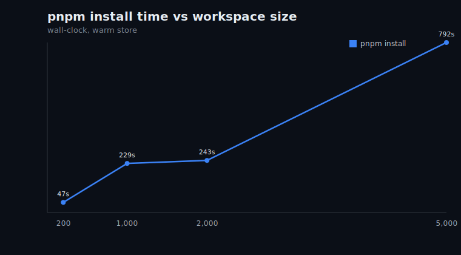
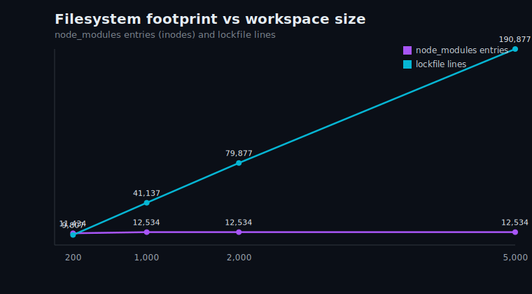

# Benchmark results

Machine: linux, generated from `bench/results.json`.

| scale | gen | install | lockfile | node_modules | typecheck cold | typecheck warm | focus build | full build tasks | focus pkgs | prune |
|---|---|---|---|---|---|---|---|---|---|---|
| **200 apps / 100 libs** | 116ms | 47s | 9,807 lines / 265KB | 11,434 entries / 355MB | 19s | 1.2s | 11s | 300 | 75 | 774ms |
| **1,000 apps / 200 libs** | 583ms | 229s | 41,137 lines / 1.1MB | 12,534 entries / 356MB | 70s | 4.4s | 14s | 1,200 | 124 | 2.1s |
| **2,000 apps / 300 libs** | 1.5s | 243s | 79,877 lines / 2.1MB | 12,534 entries / 357MB | 127s | 8.6s | 15s | 2,300 | 100 | 4.8s |
| **5,000 apps / 300 libs** | 3.3s | 792s | 190,877 lines / 5.1MB | 12,534 entries / 360MB | 287s | 19s | 23s | 5,300 | 100 | 12s |

## Charts

